## 常量

### 定义

声明后不能改变值和类型的数据。

### 类型
> 整形常量、实形常量、字符常量、字符串常量

#### 整形常量

- 十进制整数
- 八进制整数
  八进制形式的常量都以0开头
- 十六进制整数
  十六进制形式的常量都以0x开头
- 二进制整数
  二进制形式的常量都以0b开头

#### 实形常量

- 小数形式

- 单精度小数
以字母f或字母F结尾。例如:0.0f、1.01f

- 双精度小数
  - 十进制小数形式：

  例如:3.14、 6.66，默认就是双精度。可以没有整数位只有小数位，例如: .3、 .6f。

  - 指数形式以幂的形式表示
  
  以字母e或字母E后跟一个10为底的幂数，指数形式的常量就是科学计数法的另一种表示,比如123000,用科学计数法表示为1.23×10的5次方用C语言表示就是1.23e5或1.23E5字母e或字母E后面的指数必须为整数字母e或字母E前后必须要有数字字母e或字母E前后不能有空格字符常量

#### 字符常量
字符型常量都是用''(单引号)括起来的。例如:'a'、'b'、'c'，字符常量的单引号中只能有一个字符特殊情况: 如果是转义字符,单引号中可以有两个字符。例如:'\n'、'\t'

#### 字符串常量
字符串常量都是用""(双引号)括起来的。例如:"a"、"abc"、"lnj"系统会自动在字符串常量的末尾加一个字符'\0'作为字符串结束标志自定义常量后期讲解内容。

### 例子
```c
void printConst() {
    const int Name = 21;
    const float XiaoShu = 1.01f;
    const double bb = 3.14;
    const double cc = .6;
    const char dd = 'd';
    const char* ee = "ee";
    const char* ff = "李江南";
    printf("Name\tXiaoShu\tbb\tcc\tdd\tee\tff\t\n");
    printf("%d\t%f\t%f\t%f\t%c\t%s\t%s\t\n",Name,XiaoShu,bb,cc,dd,ee,ff);
}
```

## 变量
类型不变，值可以改变的量。

### 定义变量

- 为什么要定义变量?

任何变量在使用之前，必须先进行定义, 只有定义了变量才会分配存储空间, 才有空间存储数据。

- 为什么要限定类型?

用来约束变量所存放数据的类型。一旦给变量指明了类型，那么这个变量就只能存储这种类型的数据，内存空间极其有限,不同类型的变量占用不同大小的存储空间。

- 为什么要指定变量名称?

存储数据的空间对于我们没有任何意义, 我们需要的是空间中存储的值。只有有了名称, 我们才能获取到空间中的值。

#### 定义方式

- 格式1:变量类型 变量名称

```c
int a;
int b;
```

- 格式2:变量类型 变量名称,变量名称

> 连续定义, 多个变量之间用逗号(,)号隔开

```c
int a;
int a,b,c;
```

### 变量使用

#### 赋值

```c
int value = 998;
```
可以利用=号往变量里面存储数据，在C语言中,利用=号往变量里面存储数据, 我们称之为给变量赋值。

注意:这里的=号，并不是数学中的“相等”，而是C语言中的赋值运算符，作用是将右边的整型常量998赋值给左边的整型变量value赋值的时候,= 号的左侧必须是变量 (10=b,错误)

#### 初始化
> C语言中, 变量的第一次赋值，我们称为“初始化”

##### 初始化方式

- 先定义,后初始化
```c
intvalue;value=998;
```

- 定义时同时初始化
```c
inta=10;intb=4,c=2;
```

**不初始化里面存储什么?**

- 随机数
- 上次程序分配的存储空间,存数一些内容,“垃圾”
- 系统正在用的一些数据

#### 修改变量的值

多次赋值即可，每次赋值都会覆盖原来的值。

```c
int a = 10;
a = 20;
```

变量之间的值传递可以将一个变量存储的值赋值给另一个变量。

```c
int a = 10;
int b;
b = a;
```

#### 查看变量的值

- 使用printf输出一个或多个变量的值
```c
int a = 10;
printf("a=%d",a)
```

- 输出其它类型变量的值
```c
double height=1.75;
char blood='A';
printf("height=%.2f,血型是%c",height,blood);
```
##### printf函数说明

格式： %[标志][输出宽度][.精度][长度]类型

- 类型打印


```c
void printVariable(){
    int age = 21;
    float money = 3.14f;
    double high = 170.345;
    char aliasName = 'p';
    char* name = "maxwell";
    printf("Name\taliasName\thigh\tmoney\tage\t\n");
    printf("%s\t%c\t%f\t%f\t%d\n",name,aliasName,high,money,age);
}
```

- 宽度打印  

用十进制整数来指定输出的宽度, 如果实际位数多于指定宽度,则按照实际位数输出, 如果实际位数少于指定宽度则以空格补位

```c
//格式: printf("a=%[宽度]类型",a)
void printWidth(){
    int a = 111;
    printf("a=%6d",a);//000111
}
```

- 标志打印

> printf("a=%[标志][宽度]类型",a)


- 精度打印

> printf("a=%[精度]类型",a)

精度格式符以"."开头, 后面跟上十进制整数, 用于指定需要输出多少位小数, 如果输出位数大于指定的精度, 则删除超出的部分

```c
float pi = 3.1415926;
printf("pi=%.2f\n",pi);
printf("pi=%.*f\n",4,pi);
```
**注意：**

1. 实型(浮点类型)有效位数问题
  - 对于单精度数,使用%f格式符输出时,仅前6~7位是有效数字
  - 对于双精度数,使用%f格式符输出时,前15~16位是有效数字
  - 有效位数和精度(保留多少位)不同, 有效位数是指从第一个非零数字开始,误差不超过本数位半个单位的、精确可信的数位
  - 有效位数包含小数点前的非零数位
  
- 长度打印

> 格式: printf("a=%[长度]类型",a);


```c
void printLength(){
    printf("\n---------------\n");
    char a = 's';
    short int b = 123;
    int c = 123;
    long int d = 123;
    long long int e = 123;
    printf("a=%hhd\n",a);//115
    printf("b=%hd\n",b);//123
    printf("c=%d\n",c);//123
    printf("d=%ld\n",d);//123
    printf("d=%lld\n",e);//123
}
```


#### 变量的作用域

- 局部变量

局部变量是在代码块内定义的, 其作用域仅限于代码块内, 离开该代码块后无法使用

例如：
```c
int main() {
    int a = 10;//变量a只在main函数中有效
    return 0;
}

int main(){
    {
        inti=998;//作用域开始
    }//作用域结束
    printf("i=%d\n",i);//不能使用
    return 0;
}
```

- 全局变量

全局变量也称为外部变量,它是在代码块外部定义的变量

```c
int a = 20;

void main() {
    printf("a=%d\n",a);//a=20
    a = 10;
    printf("a=%d\n",a);//a=10
}

```
注意：同一作用域范围内不能有相同名称的变量

#### 全局变量和局部变量比较
| 变量类型 | 作用域                            | 生命周期                              | 存储位置  | 特点                                 |
|------|--------------------------------|-----------------------------------|-------|------------------------------------|
| 全局变量 | 从定义的那一行开始, 直到遇到}结束或者遇到return为止 | 从程序运行到定义哪一行开始分配存储空间到程序离开该变量所在的作用域 | 内存的栈区 | 不同作用范围可以定义同名变量，内部作用域的变量会覆盖外部作用域的变量 |
| 局部变量 | 从定义哪行开始直到文件结尾                  | 程序一启动就会分配存储空间,直到程序结束              | 静态存储区 | 多个同名的全局变量指向同一块存储空间                 |

#### 变量的内存分析

##### 字节和地址
为了更好地理解变量在内存中的存储细节，先来认识一下内存中的“字节”和“地址”每一个小格子代表一个字节：


**说明：**
1. 每个小格子代表一个字节
2. 每个字节都有自己的内存地址
3. 内存地址是连续的

##### 不同类型的变量占用空间大小


##### 变量存储的过程
1. 根据定义变量时声明的类型和编译环境确定需要开笔多大的存储空间
2. 在内存中开辟空间，开辟空间时从内存地址大的开始开辟（内存寻址从大到小）
3. 将数据保存到已经开辟好的对应内存空间中

##### 内存模型

内存模型是有序的，32位系统，最大内存位2^32 bit;64位系统，最大的内存为2^64bit

**cpu运行时需明确三件事：**

- 通过地址总线找到存储单元的地址
- 通过控制总线发送内存的读写指令
- 通过数据总线传输需要读写的数据

**变量存储原则：**

- 先分配字节地址大内存，然后分配字节地址小的内存（内存寻址从大到小）
- 变量的首地址，是变量所占存储空间字节地址（最小的那个地址）
- 低位保存在低地址字节上，高位保存在高地址字节上

##### char类型

char类型变量占用1个字节存储空间（共8位），除单个字符以外，C语言的转义字符也可以利用char类型存储。

一个ascll值刚好存储在一个字节上，对应一个特定的字符。


#### Scanf函数

scanf函数用于接收键盘输入的内容, 是一个阻塞式函数,程序会停在scanf函数出现的地方, 直到接收到数据才会执行后面的代码。

格式：scanf("格式控制字符串",地址列表)

地址列表项中只能传入变量地址, 变量地址可以通过&符号+变量名称的形式获取。
```c
void scanfTest(){
    int number;
    scanf("%d",&number);
    printf("number=%d\n",number);
}
```
##### 用法

- 接收非字符和字符串类型时, 空格、Tab和回车会被忽略
- 接收多条数据：格式控制字符串和地址列表项在数量和类型上必须一一对应
- 非字符和字符串情况下建议明确指定多条数据之间分隔符(\n是scanf函数的结束符号, 所以格式化字符串中不能出现\n)
```c
void manyScanf()
{
    int a,b;
    scanf("%d,%d",&a,&b);
    printf("a=%d;b=%d",a,b);
}
```
##### scanf运行原理
1. 系统会将用户输入的内容先放入输入缓冲区
2. scanf方式会从输入缓冲区中逐个取出内容赋值给变量
3. 如果输入缓冲区的内容不为空,scanf会一直从缓冲区中获取,而不要求再次输

可以利用setbuf方法清空缓冲区(所有平台有效)，格式：setbuf(stdin,NULL);

```c
void clearCache(){
    int a,b;
    char c;
    scanf("%d,%d,%c",&a,&b,&c);
    printf("a=%d;b=%d;c=%c",a,b,c);
    setbuf(stdin,NULL);//清空输入缓存区
    int a1,b1;
    char c1;
    scanf("%d,%d,%c",&a1,&b1,&c1);
    printf("a1=%d;b1=%d;c1=%c",a1,b1,c1);
}
```
#### putchar 和 getchar

```c
//向控制台输出一个字符
void putChar(){
    char a = 'a';
    putchar(a);
}

//从键盘获得一个字符
void getChar(){
    char a;
    a=getchar();//获取一个字符
    printf("ch=%c\n",a);
}
```

### 运算符

#### 运算符分类

- 功能分类：

1. 算术运算符
2. 赋值运算符
3. 关系运算符
4. 逻辑运算符
5. 位运算符

- 按参与运算的操作数个数划分：

1. 单目运算（例如：i++）
2. 双目运算（a+b）
3. 三目运算（问号表达式如:  a>b ? 1 : 0）

#### 运算符的优先级和结合性


#### 算术运算符

乘、除、求余、加、减

**注意：**
1. 如果参与运算的两个操作数皆为整数, 那么结果也为整数
2. 如果参与运算的两个操作数其中一个是浮点数, 那么结果一定是浮点数
3. 求余运算符, 本质上就是数学的商和余中的余数
4. 求余运算符, 参与运算的两个操作数必须都是整数, 不能包含浮点数
5. 求余运算符, 被除数小于除数, 那么结果就是被除数
6. 求余运算符, 运算结果的正负性取决于被除数,跟除数无关, 被除数是正数结果就是正数,被除数是负数结果就是负数
7. 求余运算符, 被除数为0, 结果为0
8. 求余运算符, 除数为0, 没有意义(不要这样写)

#### 赋值运算符
=、+=、-=、*=、/=、%=

#### 自增自减运算符

i++,i--,++i,--i

**说明：**
1. 如果只有单个变量, 无论++写在前面还是后面都会对变量做+1操作
2. 如果出现在一个表达式中, 那么++写在前面和后面就会有所区别：

前缀表达式: ++x, --x;其中x表示变量名,先完成变量的自增自减1运算,再用x的值作为表达式的值;即“先变后用”,也就是变量的值先变,再用变量的值参与运算

后缀表达式: x++, x--;先用x的当前值作为表达式的值,再进行自增自减1运算。即“先用后变”,也就是先用变量的值参与运算,变量的值再进行自增自减变

3. 自增、自减运算只能用于单个变量,只要是标准类型的变量,不管是整型、实型,还是字符型变量等,但不能用于表达式或常量（错误用法: ++(a+b);5++;）
4. 企业开发中尽量让++ -- 单独出现, 尽量不要和其它运算符混合在

#### sizeof运算符

sizeof可以用来计算一个变量或常量、数据类型所占的内存字节数。

格式：sizeof(常量 or 变量 or 数据类型);

**注意：**
1. 如果是数据类型不能省略括号
2. sizeof()和+=、*=一样是一个复合运算符, 由sizeof和()两个部分组成, 但是代表的是一个整体，所以sizeof不是一个函数, 是一个运算符, 该运算符的优先级是2

#### 逗号运算符

在C语言中逗号“,”也是一种运算符,称为逗号运算符。其功能是把多个表达式连接起来组成一个表达式,称为逗号表达式。

逗号运算符会从左至右依次取出每个表达式的值, 最后整个逗号表达式的值等于最后一个表达式的值

格式: 表达式1，表达式2，......，表达式n（例如: int result=a+1,b=3*4;）

```c
void douhao(){
    int a =10,b=20,c;
    int d = (a+1,b+4);
    printf("d=%d\n",d);//24
}
```
#### 关系运算符

<、==、<=、!=、>、=>

```c
void compare(){
    int res = 10 == 5>3;
    printf("res=%i\n",res);//0
}
```

无论是float还是double都有精度问题, 所以一定要避免利用==判断浮点数是否相等

#### 逻辑运算符
!、&&、||

#### 三目运算符

格式：表达式1？表达式2(结果A)：表达式3(结果B)

### 类型转换

- 强制类型转换

格式：(需要转换的类型)(表达式)

```c
int a = (int)1.34;
```

- 自动类型转换

1. 算数转换 

系统会自动对占用内存较少的类型做一个“自动类型提升”的操作, 先将其转换为当前算数表达式中占用内存高的类型, 然后再参与运算.

```c
double b = 1.0 / 2;
```


2. 赋值转换

赋值时左边是什么类型,就会自动将右边转换为什么类型再保存

```c
int a = 10.88;//10(直接舍去小数部分)
```
## 流程控制

顺序结构、选择结构、循环结构

### 选择结构

- if

```c
if(){
    
}else if (){
    
}else{
    
}

```
- switch

```c
swith(表达式){
    case 常量表达式1:
        语句1;
        break;
    case 常量表达式2:
        语句2;
        break;
    default:
        语句n;
        break;
}
```
计算"表达式"的值, 逐个与其后的"常量表达式"值相比较,当"表达式"的值与某个"常量表达式"的值相等时, 即执行其后的语句, 然后跳出switch语句,

如果"表达式"的值与所有case后的"常量表达式"均不相同时,则执行default后的语句。

**注意：**
1. switch条件表达式的类型必须是整型, 或者可以被提升为整型的值(char、short)
2. case的值只能是常量, 并且还必须是整型, 或者可以被提升为整型的值(char、short)
3. case后面常量表达式的值不能相同
4. case后面要想定义变量,必须给case加上大括号
5. switch中只要任意一个case匹配, 其它所有的case和default都会失效. 所以如果case和default后面没有break就会出现穿透问题
6. switch中default可以省略
7. switch中default的位置不一定要写到最后, 无论放到哪都会等到所有case都不匹配才会执行(穿透问题除外)

### 循环结构

#### while

```c
int count = 0;
while (count < 3) { // 循环控制条件
    printf("发射子弹~哔哔哔哔\n"); // 需要反复执行的语句
    count++; // 能够让循环结束的语句
}
```

**执行流程：**
1. 首先会判定"循环控制条件"是否为真, 如果为假直接跳到循环语句后面
2. 如果"循环控制条件"为真, 执行一次循环体, 然后再次判断"循环控制条件"是否为真, 为真继续执行循环体,为假跳出循环
3. 重复以上操作, 直到"循环控制条件"为假为止

#### do while

格式：
```c
do {
    循环体中的语句;
    能够让循环结束的语句;
    ....
} while (循环控制条件 );
```
示例：
```c
int count = 0;
do {
   printf("发射子弹~哔哔哔哔\n");
   count++;
}while(count < 10);
```

执行流程：

1. 首先不管while中的条件是否成立, 都会执行一次"循环体"
2. 执行完一次循环体,接着再次判断while中的条件是否为真, 为真继续执行循环体,为假跳出循环
3. 重复以上操作, 直到"循环控制条件"为假为止

#### for

格式：
```c
for(初始化表达式;循环条件表达式;循环后的操作表达式) {
    循环体中的语句;
}
```
示例：
```c
for(int i = 0; i < 10; i++){
    printf("发射子弹~哔哔哔哔\n");
}
```

执行流程：

1. 首先执行"初始化表达式"，而且在整个循环过程中,***只会执行一次***初始化表达式
2. 接着判断"循环条件表达式"是否为真，为真执行循环体中的语句
3. 循环体执行完毕后，接下来会执行"循环后的操作表达式"，然后再次判断条件是否为真,为真继续执行循环体,为假跳出循环
4. 重复上述过程，直到条件不成立就结束for循环

## 函数

### 分类

定义角度分：库函数 和 用户定义函数

执行结果分：用返回值函数 和 无返回值函数

传参角度分：无参函数 和 有参函数

### 定义

格式：
```c
返回值类型 函数名(参数类型 形式参数1,参数类型 形式参数2,...) {
    函数体;
    返回值;
}
```
## 数组

一组数据类型相同的数据的有序集合，称之为数组。

### 定义

格式：元素类型 数组名称[元素个数]

### 初始化数组

- 定义的同时初始化
  - 指定元素个数，完全初始化：int ages[3] = {1,4,5};
  - 不指定元素个数完全初始化，根据大括号的元素个数确定数组的元素个数：int nums[] = {2,4,5,32,4};
  - 指定元素个数，部分初始化，没有显式初始化的元素位0:int[10] = {2,4}
  - 指定元素个数，部分初始化：int num[5] = {[1] = 2,[3] = 4}
  - 不指定元素个数，部分初始化：int nums[] = {[4] = 3}

- 先定义后初始化

int nums[3];nums[2] = 1;

没有初始化会怎么样？

如果定义数组后，没有初始化，数组中是有值的，是随机的垃圾数，所以使用数组需要进行初始化。

数组只能在定义的时候初始化多个值，不能先定义再初始化多个值：例如：
```c
int ages[3];
ages[3] = {3,5,6};//报错
```

### 数组使用

#### 通过索引下标读取元素的值

#### 遍历

#### 计算长度

```c
int ages[4] = {19,22,33,13};
int lenght = sizeof(ages) / sizeof(int);
printf("length=%d",length) //输出4

```
### 数组的内存存储细节

**存储方式:**

1. 内存寻址从大到小，从高地址开辟一块连续的没有被使用的内存给数组
2. 在分配的连续存储空间中，从地址小的位置开始给每个元素分配空间
3. 在每个元素分配的存储空间中，地址最大的位置开始存储数据
4. 用数组名指向整个存储空间最小的地址

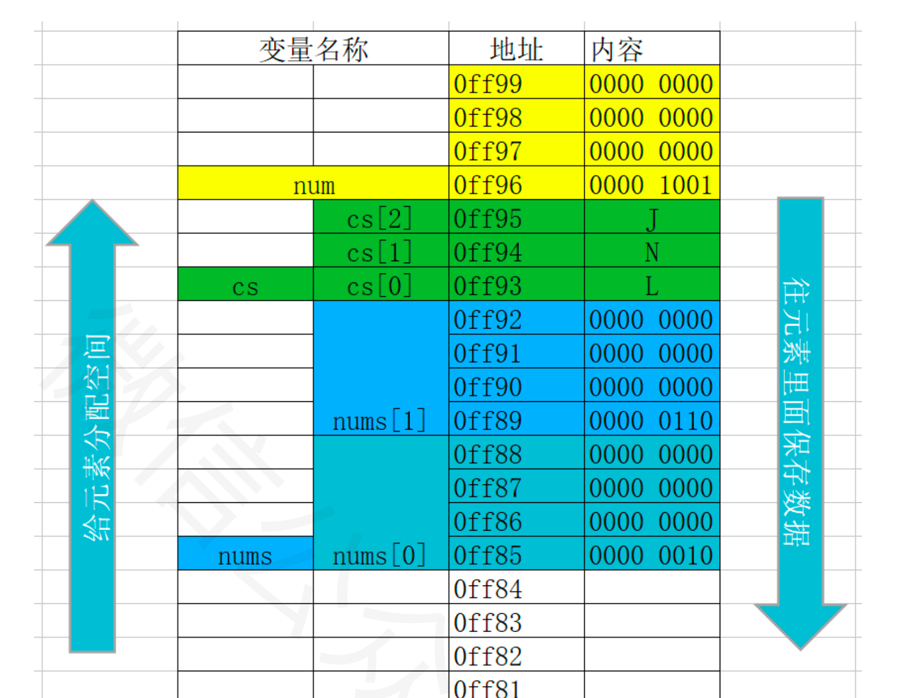

### 数组与函数的关系

**要确定一个一维数组需要知道哪些信息？**

1. 是数组的首地址
2. 数组的长度

因为数组是连续存放的，只要知道数组的首地址和数组的长度就能找到这个数组中所有的元素。

要想通过实参和形参将一个数组从主调函数传到被调函数，那么只需要传递以上这两个信息即可。
对于一维数组来说，其数组名就表示一维数组的首地址。所以只需要传递数组名和数组长度这两个参数就可以将数组从主调函数传入被调函数中。
```c
void arrayV3(int arr[],int count){
    printf("arr[3]=%d\n",arr[2]);//3
    printf("arr的长度为=%d\n",count);//5
    arr[2] = 10;
    printf("arr[2]=%d\n",arr[2]);//10
}

void callArrFun(){
    int arr[5] = {1,4,3,7,13};
    arrayV3(arr,5);
    printf("arr[2]=%d\n",arr[2]);//10
}
```

#### 数组作为函数参数时注意事项

- 当数组名作为函数的实参时，形参列表中也应该定义相应的数组（或用指针变量），且定义数组的类型必须与实参数组的类型一致，如果不一致就会出错。
> 形参中定义的数组无须指定数组的长度，而是再定义一个参数用于传递数组的长度。所以在传递实参的时候，数组名和数组长度也只能用两个参数分开传递，而不能写在一起。
因为即使写在一起，系统在编译时也只是检查数组名，并不会检查数组长度。所以数组长度要额外定义一个变量进行传递。

> 在C语言中,数组名除作为变量的标识符之外,数组名还代表了该数组在内存中的起始地址,因此,当数组名作函数参数时,实参与形参之间不是"值传递",而是"地址传递"。\n
> 实参数组名将该数组的起始地址传递给形参数组,两个数组共享一段内存单元, 系统不再为形参数组分配存储单元。既然两个数组共享一段内存单元, 所以形参数组修改时，实参数组也同时被修改了

```c
void arrayV3(int arr[],int count){//形参也为数组（不用写数组长度，用另外参数传递）
    printf("arr[3]=%d\n",arr[2]);//3
    printf("arr的长度为=%d\n",count);//5
    arr[2] = 10;
    printf("arr[2]=%d\n",arr[2]);//10
}

void callArrFun(){
    int arr[5] = {1,4,3,7,13};
    arrayV3(arr,5);//数组名作为实参
    printf("arr[2]=%d\n",arr[2]);//10
}
```

- 数组的元素作为函数实参，与同类型的简单变量作为实参一样，如果是基本数据类型, 那么形参的改变不影响实参
> 注意：用数组元素作函数实参时，不要求形参也必须是数组元素
```c
void change(int val)//int val = number
{    
    val = 55;
}
int main(int argc, const char * argv[]){    
    int ages[3] = {1, 5, 8};    
    printf("ages[0] = %d", ages[0]);// 1    
    change(ages[0]);    
    printf("ages[0] = %d", ages[0]);// 1
}
```

**注意：**

1. 在函数形参表中,允许不给出形参数组的长度
```c
void change(int array[]){
    array[0] = 88;
}
```
2. 形参数组和实参数组的类型必须一致,否则将引起错误
```c
// 错误写法
void prtArray(double array[3]){    
    for (int i = 0; i < 3; i++) {       
        printf("array[%d], %f", i, array[i]);    
    }
}
int main(int argc, const char * argv[]){    
    int ages[3] = {1, 5, 8};    
    prtArray(ages[0]);
}

```
3. 当数组名作为函数参数时, 因为自动转换为了指针类型，所以在函数中无法动态计算除数组的元素个数
```c
void printArray(int array[]){   
    printf("printArray size = %lu\n", sizeof(array)); // 8    
    int length = sizeof(array)/ sizeof(int); // 2    
    printf("length = %d", length);
}

int main(){    
    int ages[3] = {1, 5, 8};    
    prtArray(ages);
}
```
解释：因为数组名做函数参数时，只是将实参数组的“首地址”传给了形参数组。此时被调函数 AddArray 中的数组 array 本质上是一个指针变量，
里面存放的是主调函数中数组 a 的地址。指针变量也是一个变量类型。不同于前面所讲的其他变量类型，指针变量里面存放的不是一般的数据，而是地址。在 C 语言中，32位系统，指针变量所占的字节数是4，64位系统，指针变量所占的字节数是8。所以对 array 使用 sizeof 求出的就是4或者8

### 二维数组

#### 初始化

- 定义并初始化
```c
int array1[2][3] = {{1,2,3},{6,7,8}};
```


- 先定义后初始化
```c
int array2[2][3];array2[1][2] = 4;
```
  - 按行分段赋值
```c
int a[2][3] = {{80,75,92},{61,65,71}};
```

  - 按行连续赋值
```c
int b[2][3] = {80,75,92,61,65,71}//从[0][0]->[0][1]->[0][2]->[1][0]->...->[1][2]
```
- 完全初始化,可以省略第一维的长度
```c
int a[][3] = {{1,2,3},{4,5,6}};
int a [][3]={1,2,3,4,5,6};
```

- 部分初始化,可以省略第一维的长度
```c
int a[][3] = {{1},{4,5}};
int a[][3] = {1,2,3,4}
```

- 指定元素的初始化
```c
int a[2][3] = {[1][2]=10};
int a[2][3]={[1]={1,2,3}};
```

#### 二维数组的存储

1. 给数组分配存储空间从内存地址大开始分配
2. 给数组元素分配空间, 从所占用内存地址小的开始分配
3. 往每个元素中存储数据从高地址开始存储

```c
int erArrayV2(){
    char cs[2][3]={
            {'a','b','c'},
            {'d','e','f'}
    };
    //cs == &cs == &cs[0] == &cs[0][0]
    printf("cs=%p\n",cs);//0060FEAA
    printf("&cs=%p\n",&cs);//0060FEAA
    printf("&cs[0]=%p\n",&cs[0]);//0060FEAA
    printf("&cs[0][0]=%p\n",&cs[0][0]);//0060FEAA
    return 0;
}
```
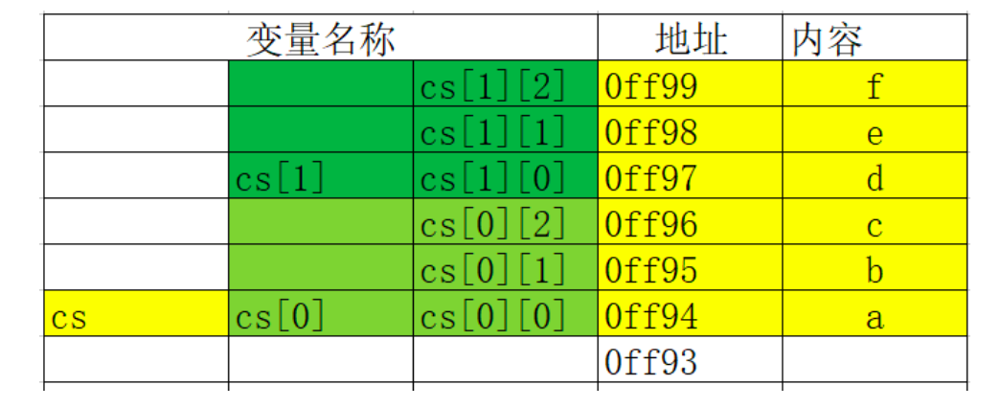

#### 二维数组与函数

- 值传递
> 和一维数组一样,只看形参是基本类型还是数组类型，如果是基本类型在函数中修改形参不会影响实参

```c
int erArray3(char ch){
    ch = 'g';
    return 0;
}

int callErArray(){
    char ch1[2][3] = {{'a','b','c'},{'a','s','d'}};
    erArray3(ch1[1][2]);
    putchar(ch1[1][2]);//d
    return 0;
}
```

- 地址传递
> 和一维数组一样,只看形参是基本类型还是数组类型,如果是数组类型在函数中修改形参会影响实参


```c
int erArray4(char ch[][3]){
    ch[0] = 'k';
    ch[1] = 'p';
    ch[2] = 'l';
}

int erArray5(char ch[][3]){
    ch[1][2] = 'w';
}

int callErArray(){
    char ch1[2][3] = {{'a','b','c'},{'a','s','d'}};
    erArray3(ch1[1][2]);
    printf("ch1[1][2]=%c\n",ch1[1][2]);//d
    erArray4(ch1[1]);
    printf("ch1[1][2]=%c\n",ch1[1][2]);//l
    erArray5(ch1);
    printf("ch1[1][2]=%c\n",ch1[1][2]);//w
    return 0;
}
```

说明：
1. 二维数组作为函数参数，在被调函数中不能获得其有多少行，需要通过参数传入
```c
int erArray6(char ch[2][3]){
    int row = sizeof(ch);
    printf("row=%zu\n",row);//输出4或8
}
```


2. 二维数组作为函数参数，在被调函数中可以计算出二维数组有多少列
```c
int erArray7(char ch[][3]){
    int col = sizeof(ch[0]);//输出3
    printf("row=%zu\n",col);
}
```

## 字符串

字符串是位于双引号中的字符序列，在内存中以“\0”结束,所占字节比实际多一个。


### 初始化

在C语言中没有专门的字符串变量,通常用一个字符数组来存放一个字符串。当把一个字符串存入一个数组时,会把结束符‘\0’存入数组,并以此作为该字符串是否结束的标志。有了‘\0’标志后,就不必再用字符数组的长度来判断字符串的长度了。

- char name[9]="lnj";//在内存中以“\0”结束，\0ASCII码值是0;
- char name1[9]={'l','n','j','\0'};
- char name2[9]={'l','n','j',0};//当数组元素个数大于存储字符内容时,未被初始化的部分默认值是0,所以下面也可以看做是一个字符串char name3[9]={'l','n','j'};

错误的初始化：

- 省略元素个数时,不能省略末尾的"\n"
```c
char name4[]={'l','n','j'};//
```
- 中间不能包含"\0",因为\0是字符串的结束标志
```c
char name[]="c\0ool";
printf("name=%s\n",name);
//输出结果:c
```

### 字符串输出

如果字符数组中存储的是一个字符串, 那么字符数组的输入输出将变得简单方便。不必使用循环语句逐个地输入输出每个字符。
可以使用printf函数和scanf函数一次性输出输入一个字符数组中的字符串使用的格式字符串为“%s”,表示输入、输出的是一个字符串字符串的输出。

- 输入
> 对一个字符串数组, 如果不做初始化赋值, 必须指定数组长度ch最多存放由9个字符构成的字符串，其中最后一个字符的位置要留给字符串的结尾标示"\0"
> 当用scanf函数输入字符串时,字符串中不能含有空格,否则将以空格作为串的结束
```c
char ch[10];
scanf("%s",ch);
```

- 输出
> %s的本质就是根据传入的name的地址逐个去取数组中的元素然后输出，直到遇到\0位置

```c
char chs[]="lnj";
printf("%s\n",chs);
```
\0引发的脏读问题:
```c
char name[]={'c','o','o','l','\0'};
char name2[]={'l','n','j'};
printf("name2=%s\n",name2);//输出结果:lnjcool
```

### 字符串常用方法
C语言中供了丰富的字符串处理函数,大致可分为字符串的输入、输出、合并、修改、比较、转换、复制、搜索几类。 使用这些函数可大大减轻编程的负担。
使用输入输出的字符串函数,在使用前应包含头文件"stdio.h"，使用其它字符串函数则应包含头文件"string.h"。

#### puts

作用：把字符数组中的字符串输出到显示终端
```c
#include <stdio.h>
void putString(){
    char ch[] = "hello word";
    puts(ch);
}
```
#### gets

作用：从标准输入设备键盘上输入一个字符串
```c
void getString(){
    char ch[30];
    gets(ch);
    puts(ch);
}
```
注意：可以看出当输入的字符串中含有空格时,输出仍为全部字符串。说明gets函数并不以空格作为字符串输入结束的标志,而只以回车作为输入结束。这是与scanf函数不同的。注意gets很容易导致数组下标越界，是一个不安全的字符串操作函数。

#### 字符串长度

- sizeof
```c
char name[]="it666";
int size=sizeof(name);//包含\0
printf("size=%d\n",size);//输出结果：0
```
- strlen
测字符串的实际长度(不含字符串结束标志‘\0’)并作为函数返回值。

```c
void getStrLen(){
    char ch[] = "hello world";
    printf("ch字符串长度sizeof=%d,strlen=%d",sizeof(ch), strlen(ch));//12，11
}
```

#### 字符串连接函数:strcat
格式: strcat(字符数组名1,字符数组名2)

功能:把字符数组2中的字符串连接到字符数组1中字符串的后面,并删去字符串1后的串标志 “\0”。本函数返回值是字符数组1的首地址。
```c
void stringCat(){
    char ch1[50] = {'h','e','l','l','o','\0','a','b','c'};
    char ch2[30] = {'w','o','r','l','\0','d'};
    strcat(ch1,ch2);
    puts(ch1);//helloworl
}
```

注意：本函数要求字符数组1应有足够的长度,否则不能全部装入所拷贝的字符串。

#### 字符串比较函数:strcmp

格式: strcmp(字符数组名1,字符数组名2)

功能:按照ASCII码顺序比较两个数组中的字符串,并由函数返回值返回比较结果。

- 字符串1=字符串2,返回值=0;
- 字符串1>字符串2,返回值>0;
- 字符串1<字符串2,返回值<0
```c
void stringCmp(){
    char ch1[50] = "hello";
    char ch2[30] = "hallo";
    int res = strcmp(ch1,ch2);
    printf("res=%d",res);//4
}
```

编写一个函数char_contains(char str[],char key)，如果字符串str中包含字符key则返回数值1，否则返回数值0.

```c
int char_contains(char str[],char key){
    int strLen = strlen(str);
    int res = 0;
    for (int i=0;i<strLen;i++) {
        if(str[i]==key){
            res = 1;
            break;
        }
    }
    return res;
}
```
### 字符串数组

- 存储一个同学的姓名：char name[32] = "maxwell"
- 存储一个班同学的姓名：char name[50][32] = {"xiaohong","xiaoming"}
- 存储一个年级所有班的同学姓名：char name[10][50][32] = {{"xiaohong","xiaoming"},{"aaa","bbbb"}}

## 指针

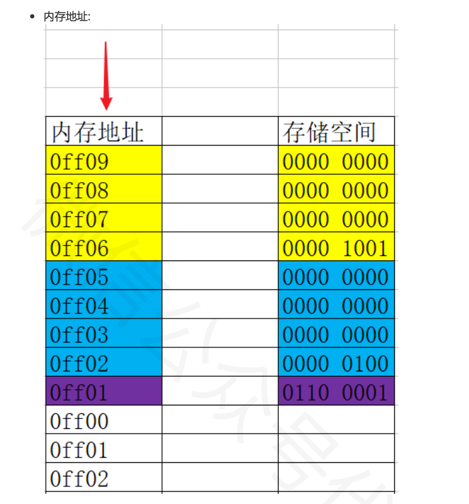

地址如同房间号，用于找到对应的内存空间；存储空间如同房间，存储数据。

变量地址：系统分配给变量的内存单元的起始地址。
```c
#include <stdio.h>
void printAddress(){
    int num = 6;//占用4个字节，假设地址为：0x7ff7ba4f63ec
    char a = 'a';//占用1个字节，地址为:0x7ff7ba4f63eb
    printf("num的地址为%p\na的地址为%p",&num,&a);
}
```
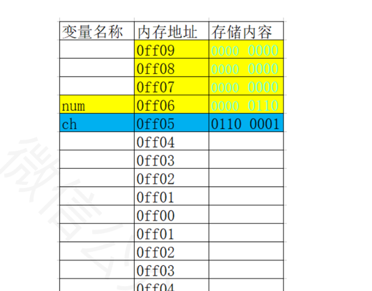

### 什么是指针

在计算机中，所有的数据都是存储在内存单元中的，而每个内存单元对应一个内存地址，只要通过这个地址就能找到对应的内存单元中的数据。

指针：由于通过地址就能找到所需的变量单元，所以我们说该地址指向该变量单元。将地址形象化成为"指针"。

指针变量：在C语言中允许一个变量存放其他变量的地址（64位系统地址占用8个字节），这种专门用来存放其他变量地址的变量称为指针变量。

```c
void point(){
    int a = 10;
    int *aPoint = &a;
    printf("aPoint=%p",aPoint);
}
```
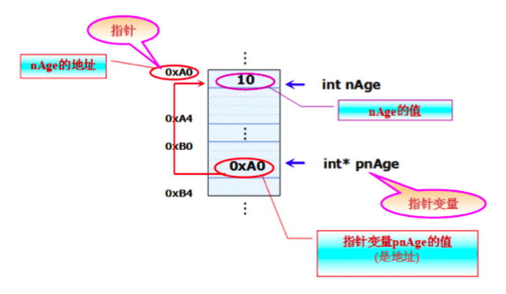

### 定义指针变量
指针变量的定义包括两个内容：指针类型说明（即定义变量为一个指针变量） 和 指针变量名。

```c
char a ='a';
char* a = &a;
```
- 其中,*表示这是一个指针变量
- 变量名即为定义的指针变量名
- 类型说明符表示本指针变量所指向的变量的数据类型

### 指针变量初始化

#### 定义的同时初始化
```c
char a ='a';
char *b = &a;
```

#### 先定义后初始化
```c
char a ='a';
char *a;
b = &a;
```

把指针初始化为NULL：
```c
int *a = NULL;
int *b = 0;
```

给指针变量赋值时,指针变量前不能再加“*”:
```c
int*p;
*p=&a;//错误写法
```

**注意事项：**
1. 多个指针变量可以指向同一个地址
```c
void point2(){
    int a = 1;
    int *b = &a;
    printf("指针b=%d\n",*b);//1
    int *c = &a;
    a = 34;
    printf("指针b=%d\n",*b);//34
    printf("指针c=%d\n",*c);//34
}
```
2. 指针的指向是可以改变的
```c
    int a = 1;
    int z = 22;
    int *c = &a;
    printf("指针c=%d\n",*c);//1
    c = &z;
    printf("指针c=%d\n",*c);//22
```

3. 指针没有初始化里面是一个垃圾值,这时候我们称之为这是一个野指针。
4. 野指针可能会导致程序崩溃，野指针访问你不该访问数据。所以指针必须初始化才可以访问其所指向存储区。

### 访问指针所指向的存储空间

C语言中提供了地址运算符&来表示变量的地址。其一般形式为:&变量名

C语言中提供了*来定义指针变量和访问指针变量指向的内存存储空间。

在定义变量的时候 * 是一个类型说明符,说明定义的这个变量是一个指针变量：
```c
int *a = &1;
```
在不是定义变量的时候 *是一个操作符,代表访问指针所指向存储空间:
```c
int a = 11;
int *b = &a;
printf("指针b指向的内存变量值为：%uz",*b);
```

### 指针类型

在同一种编译器下, 所有指针占用的内存空间是一样的,但不同类型的变量却占不同的字节数。64位系统指针占8个字节。

二级指针：如果一个指针变量存放的又是另一个指针变量的地址,则称这个指针变量为指向指针的指针变量。也称为“二级指针”。
```c
void point3(){
    char c='a';
    char *cp;
    cp = &c;
    char **cp2;
    cp2 = &cp;
    printf("c=%c",**cp2);//a
}
```
无论多少级指针，其规律遵循二级指针的规律。

应用场景1:交换2个数：
```c
void change(){
    int a = 1;
    int b = 2;
    int *ap = &a;
    int *bp = &b;

    int tmp;
    tmp = *ap;
    *ap = *bp;
    *bp = tmp;
    printf("a=%zu,b=%zu",a,b);
}
```

应用场景2:函数同时返回2个数之和和两个数之差：
```c
void jishuan(int a, int b,int *sub,int *add){
    *add = a + b;
    *sub = a-b;
}
```

### 数组指针的概念及定义

数组元素指针：每个变量都有地址,一个数组包含若干元素,每个数组元素也有相应的地址, 指针变量也可以保存数组元素的地址，只要一个指针变量保存了数组元素的地址, 我们就称之为数组元素指针。
```c
void pointArr(){
    int a[3] = {3,7,9};
    printf("%p\n%p",&(a[0]),a);//输出结果相同
}
```

注意: 
- 数组名a不代表整个数组,只代表数组首元素的地址。
- “p=a;”的作用是“把a数组的首元素的地址赋给指针变量p”,而不是“把数组a各元素的值赋给p。

### 指针访问数组元素

在指针指向数组元素时,允许以下运算:
- 加一个整数(用+或+=),如p+1
- 减一个整数(用-或-=),如p-1
- 自加运算,如p++,++p
- 自减运算,如p--,--p

**如果指针变量p已指向数组中的一个元素,则p+1指向同一数组中的下一个元素,p-1指向同一数组中的上一个元素。**
- 下标法,  如a[i]形式
- 指针法, *(p+i)形式
```c
void pintArr2(){
    int a[3] = {2,6,4};
    printf("a[2]=%d\n",a[2]);//下标法
    int *p = a;
    printf("a[2]=%d\n",*(p+2));//指针法
}
```
> 数组名虽然是数组的首地址，但是数组名所保存的数组的首地址是不可以更改的。
```c
int x[10];
x++;//错误
int *p = x;
p++;//正确
```

### 指针和字符串

定义字符串的两种方式：

- 字符数组
```c
void printArr3(){
    char ch[] = "hello";
    printf("%s\n",ch);
}
```
- 字符串指针指向字符串
> 数组名保存的是数组第0个元素的地址,指针也可以保存第0个元素的地址
```c
void printArr4(){
    char *str="abc";
    printf("%s\n",str);
}
```
**字符串指针使用注意事项**
- 可以查看字符串的每一个字符
```c
void printArr5(){
    char *myStr = "i love you!";
    for(int i=0;i< strlen(myStr);i++){
        printf("myStr[i]=%c\n",myStr[i]);
    }
}
```
- 不可以修改字符串内容
  - 使用字符数组来保存的字符串是保存栈里的,保存栈里面东西是可读可写,所以可以修改字符串中的的字符
  - 使用字符指针来保存字符串,它保存的是字符串常量地址,常量区是只读的,所以我们不可以修改字符串中的字符

```c
char *str="lnj";
*(str+2)='y';//错误
```

- 不能够直接接收键盘输入
```c
char *str;
scanf("%s",str);//错误
// 错误的原因是:str是一个野指针,他并没有指向某一块内存空间,所以不允许这样写。
// 如果给str分配内存空间是可以这样用的
```

### 指向函数的指针

为什么指针可以指向一个函数？

函数作为一段程序，在内存中也要占据部分存储空间，它也有一个起始地址；函数有自己的地址，我们的指针变量就是用来存储地址的。因此可以利用一个指针指向一个函数。其中，函数名就代表着函数的地址。

#### 指针函数的定义

格式: 返回值类型(*指针变量名)(形参1,形参2,...);

```c
int printArr6(int a,int b){
    return a + b;
}

void callPrintArr6(){
    int(*p)(int,int);
    p = printArr6;
}
```
指针函数定义技巧:
1. 把要指向函数头拷贝过来
2. 把函数名称使用小括号括起来
3. 在函数名称前面加上一个*
4. 修改函数名称

应用场景:
1. 调用函数
2. 将函数作为参数在函数间传递

注意：
1. 由于这类指针变量存储的是一个函数的入口地址，所以对它们作加减运算(比如p++)是无意义的
2. 函数调用中"(指针变量名)"的两边的括号不可少,其中的括号不应该理解为求值运算,在此处它只是一种表示符号

## 结构体
- 结构体和数组一样属于构造类型
- 数组是用于保存一组相同类型数据的, 而结构体是用于保存一组不同类型数组的。
> 例如,在学生登记表中,姓名应为字符型;学号可为整型或字符型;年龄应为整型;性别应为字符型;成绩可为整型或实型。显然这组数据不能用数组来存放,.为了解决这个问题,C语言中给出了另一种构造数据类型——“结构(structure)”或叫“结构体”

### 定义

结构体是用来保存不同数据类型字段的一种构造类型数据类型。

格式：
```c
struct 结构体名{
    类型名1 成员名1;
    类型名2 成员名2;
    ... ...;
    类型名n 成员名n;
};
```
示例：
```c
struct Student{
    char *name;//姓名
    int age;//年龄
    float height;//身高
};
```
### 声明结构体变量
格式: struct 结构体名 结构体变量名

- 先定义结构体类型，再声明变量
```c
struct Student{
    char* name;
    int age;
};
struct Student stu;
```

- 定义结构体类型的 同时声明变量
```c
struct Student{
    char* name;
    int age;
} stu;
```
- 匿名结构体定义结构体变量
```c
struct {
    char* name;
    int age;
} stu;
```
> 第三种方法与第二种方法的区别在于,第三种方法中省去了结构体类型名称,而直接给出结构变量,这种结构体最大的问题是结构体类型不能复用

### 访问结构体变量成员

一般对结构体变量的操作是以成员为单位进行的，引用的一般形式为：结构体变量名.成员名
```c
struct Student{
    char* name;
    int age;
};
struct Student stu;
stu.age = 17;
printf("age=%d",stu.age);
```

### 结构体变量初始化
- 声明的同时按顺序初始化
```c
struct Student{
    char* name;
    int age;
};
struct Student stu={"KLP",18};
```
- 定义的同时不按顺序初始化
```c
struct Student{
    char* name;
    int age;
};
struct Student stu={.name="klp",.age=18};
```
- 先定义后逐个初始化
```c
struct Student{
    char* name;
    int age;
};
struct Student stu;
stu.name = "klp";
stu.age = 18;
```
- 先定义后一次性初始化
```c
struct Student{
    char* name;
    int age;
};
stu = (struct Student){"klp",18};
```

### 结构体类型作用域
- 结构类型定义在函数内部的作用域与局部变量的作用域是相同的,从定义的那一行开始, 直到遇到return或者大括号结束为止。
```c
struct Student{
    char* name;
    int age;
};

void structTest1(){
    //定义局部结构体名为Student,会屏蔽全局结构体
    // 局部结构体作用域,从定义开始到“}”块结束
    struct Student{
        char* name;
        int height;
    };
    struct Student stu1;
    stu1.name = "kkkk";
    stu1.height = 80;
    printf("stu1.name=%s,stu1.height=%d\n",stu1.name,stu1.height);
}
```

- 结构类型定义在函数外部的作用域与全局变量的作用域是相同的，从定义的那一行开始,直到本文件结束为止。
```c
struct Student{
    char* name;
    int age;
};
void structTest2(){
    struct Student stu2;
    stu2.name = "kkkk";
    stu2.age = 80;
    printf("stu1.name=%s,stu1.age=%d\n",stu2.name,stu2.age);
}
```

### 结构体数组

结构体数组和普通数组并无太大差异, 只不过是数组中的元素都是结构体而已

格式:  struct 结构体类型名称 数组名称[元素个数]

结构体数组初始化和普通数组也一样, 分为先定义后初始化和定义同时初始化

- 定义同时初始化
```c
void structTest3(){
    struct Person{
        char* name;
        char* sex;
    };
    struct  Person perArr[3] = {{"lnj","男"},{"zs","女"},{"zss","女"}};
    printf("stu0.name=%s,stu1.sex=%s\n",perArr[0].name,perArr[0].sex);
}
```
- 先定义后初始化
```c
void structTest5(){
    struct Student{
        char *name;
        int age;
    };
    struct Student stu[2];
    stu[0].name = "kkl";
    stu[0].age = 33;
    printf("stu0.name=%s,stu1.age=%d\n",stu[0].name,stu[0].age);
}
```
> 先定义后初始化时，无法初始化多个元素，也无法初始化一个元素的多个字段

### 结构体指针

一个指针变量当用来指向一个结构体变量时,称之为结构体指针变量

格式: struct 结构名 *结构指针变量名
```c
void structTest6(){
    struct Student{
        char *name;
        int age;
    };
    //定义一个结构体变量
    struct Student stu={"lnj",18};
    //定义一个指向结构体的指针变量
    struct Student *stup;
    //指向结构体变量stu
    stup=&stu;
    //方式1：结构体变量名.成员名
    printf("name=%s,age=%d\n",stu.name,stu.age);
    //方式2：(*指针变量名).成员名
    printf("name=%s,age=%d\n",(*stup).name,(*stup).age);
    //方式3：指针变量名->成员名
    printf("name=%s,age=%d\n",stup->name,stup->age);
}
```
通过结构体指针访问结构体成员, 可以通过以下两种方式:
- (*结构指针变量).成员名 (说明：(*stup)两侧的括号不可少,因为成员符"."的优先级高于"*")
- 结构指针变量->成员名 (用熟)

### 结构体内存分析

- 给结构体变量开辟存储空间从内存地址大的位置开始开辟(高位寻址)
- 根据结构体的定义结构，从上到下依次给结构体的变量分配内存空间
- 给结构体成员开辟存储空间从所占用内存地址小的位置开始开辟
- 结构体变量占用的内存空间永远是所有成员中占用内存最大成员的倍数(对齐问题)
> 计算机系统对基本类型数据在内存中存放的位置有限制,它们会要求这些数据的起始地址的值是某个数k的倍数,这就是所谓的内存对齐,而这个k则被称为该数据类型的对齐模数(alignmentmodulus)。

> 这种强制的要求一来简化了处理器与内存之间传输系统的设计,二来可以提升读取数据的速度。比如这么一种处理器,它每次读写内存的时候都从某个8倍数的地址开始,一次读出或写入8个字节的数据,
> 假如软件能保证double类型的数据都从8倍数地址开始,那么读或写一个double类型数据就只需要一次内存操作。否则,我们就可能需要两次内存操作才能完成这个动作,因为数据或许恰好横跨在两个符合对齐要求的8字节内存块上。

#### 结构体变量占用存储空间大小
案例一：
```c
struct Student{
    int age;//4
    char ch;//1
    double score;//8
};
printf("Student sizeof=%d",sizeof(Student));//16
```
- 占用内存最大属性是score, 占8个字节, 所以第一次会分配8个字节
- 将第一次分配的8个字节分配给age 4个,分配给ch 1个, 还剩下3个字节
- 当需要分配给score时, 发现只剩下3个字节, 所以会再次开辟8个字节存储空间，一共开辟了两次8个字节空间, 所以最终p占用16个字节

案例二：
```c
struct Student{
    int age;//4
    double score;//8
    char ch;//1
};
printf("Student sizeof=%d",sizeof(Student));//16
```
- 占用内存最大属性是score, 占8个字节, 所以第一次会分配8个字节
- 将第一次分配的8个字节分配给age 4个,还剩下4个字节
- 当需要分配给score时, 发现只剩下4个字节, 所以会再次开辟8个字节存储空间给score
- 剩下0空间，需要再开辟8个字节存储空间给ch,一共是24

### 结构体嵌套

结构体的成员也可能是结构体，构成嵌套结构体。

```c
struct Date{
    int year;
    int month;
    int day;
};
struct Student{
    int age;
    char *name;
    struct Date birthday;
    double score;
};
```
在Student中，嵌套结存储Data，形式如下：
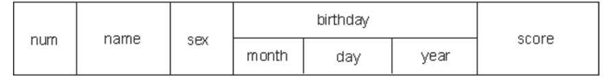

注意：结构体不可以嵌套自己变量,可以嵌套指向自己这种类型的指针
```c
struct Student{
    int age;
    struct Student stu;//错误的写法
    struct Student *stu;//可以这样写
};
```
#### 访问嵌套结构体成员
如果某个成员也是结构体变量，可以连续使用成员运算符"."访问最低一级成员

```c
void structTest9(){
    struct Date{
        int year;
        int month;
        int day;
    };
    struct Student{
        int age;
        char *name;
        double score;
        struct Date birthday;
    };
    struct Student stu1 = {13,"xiaoming",88,{2020,11,12}};
    printf("stu1的出生年份是：%d",stu1.birthday.year);//2020
}
```
### 结构体和函数

- 结构体虽然是构造类型, 但是结构体之间赋值是值拷贝, 而不是地址传递

- 结构体变量作为函数形参时也是值传递, 在函数内修改形参, 不会影响外界实参
```c
void structTest10(struct Student stu1){
    stu1.name = "xxxx";
    printf("stu1的name是：%s\n",stu1.name);//xxx
}

void callStructTest10(){
    struct Student stu1 = {"klp",20};
    printf("stu1的name是：%s\n",stu1.name);//klp
    structTest10(stu1);
    printf("stu1的name是：%s\n",stu1.name);//klp
}
```

## 共用体

- 和结构体不同的是, 结构体的每个成员都是占用一块独立的存储空间, 而共用体所有的成员都占用同一块存储空间
- 和结构体一样, 共用体在使用之前必须先定义共用体类型, 再定义共用体变量。

定义共用体类型格式:
```c
union 共用体名{
    数据类型 属性名称;
    数据类型 属性名称;
    .......
}
```

定义共用体类型变量格式:
```c
union 共用体名 共用体变量名称;
```

特点: 由于所有属性共享同一块内存空间, 所以只要其中一个属性发生了改变, 其它的属性都会受到影响.
```c
void unionTest1(){
    union obj{
        char ch;
        int age;
    };
    union obj obj1;
    printf("sizeof(obj1)=%lu\n",sizeof(obj1));
    obj1.age = 33;
    printf("obj1.ch=%c\nobj1.age=%d\n",obj1.ch,obj1.age);//! 33
    obj1.age = 97;
    printf("obj1.ch=%c\nobj1.age=%d\n",obj1.ch,obj1.age);//a 97
}
```
共用体的应用场景:

1. 通信中的数据包会用到共用体，因为不知道对方会发送什么样的数据包过来，用共用体的话就简单了，定义几种格式的包，收到包之后就可以根据包的格式取出数据。
2. 节约内存。如果有2个很长的数据结构，但不会同时使用，比如一个表示老师，一个表示学生，要统计老师和学生的情况，用结构体就比较浪费内存，这时就可以考虑用共用体来设计
3. 某些应用需要大量的临时变量，这些变量类型不同，而且会随时更换。而你的堆栈空间有限，不能同时分配那么多临时变量。这时可以使用共用体让这些变量共享同一个内存空间，这些临时变量不用长期保存，用完即丢，和寄存器差不多，不用维护。

## 枚举

什么是枚举类型?

在实际问题中,有些变量的取值被限定在一个有限的范围内。例如,一个星期内只有七天,一年只有十二个月,一个班每周有六门课程等等。
如果把这些量说明为整型,字符型或其它类型显然是不妥当的。C语言提供了一种称为“枚举”的类型。

在“枚举”类型的定义中列举出所有可能的取值, 被说明为该“枚举”类型的变量取值不能超过定义的范围。该说明的是,枚举类型是一种基本数据类型,而不是一种构造类型,因为它不能再分解为任何基本类型。

### 定义枚举
```c
enum 枚举名{
    枚举元素1,
    枚举元素2,
    ...
};
```
示例：
```c
enum Season{
    Spring,
    Summer,
    Autumn,
    Winter
};
```
枚举变量定义：

- 先定义枚举类型，再定义枚举变量
```c
enum Season{
    Spring,
    Summer,
    Autumn,
    Winter
};
enum Season s;
```
- 定义枚举类型的同时定义枚举变量
```c
enum Season{
    Spring,
    Summer,
    Autumn,
    Winter
} s;
```
- 省略枚举名称，直接定义枚举变量
```c
enum {
    Spring,
    Summer,
    Autumn,
    Winter
} s;
```

### 枚举变量的赋值和使用

```c
void enumTest1(){
    enum Season{
        Spring,
        Summer,
        Autumn,
        Winter
    } s;
    s=Spring;//等价于s=0;
    s=3;//等价于s=winter;
    printf("%d",s);//3
}
```

**注意：**
1. C语言编译器会将枚举元素(spring、summer等)作为整型常量处理，称为枚举常量。
2. 枚举元素的值取决于定义时各枚举元素排列的先后顺序。默认情况下，第一个枚举元素的值为0，第二个为1，依次顺序加1。也可以在定义枚举类型时改变枚举元素的值。
```c
enum Season{
    Spring=9,
    Summer,
    Autumn,
    Winter
};
//也就是说spring的值为9，summer的值为10，autumn的值为11，winter的值为12
```

## C语言关键字

### auto

只能修饰局部变量, 局部变量如果没有其它修饰符, 默认就是auto的。

特点: 随用随开, 用完即销

```c
auto int num;//等价于int num;
```

### register

只能修饰局部变量, 原则上将内存中变量提升到CPU寄存器中存储, 这样访问速度会更快。

但是由于CPU寄存器数量相当有限,通常不同平台和编译器在优化阶段会自动转换为auto。

### static

#### 对局部变量的作用
延长局部变量的生命周期,从程序启动到程序退出,但是它并没有改变变量的作用域。 且定义变量的代码在整个程序运行期间仅仅会执行一次。
```c
int main(){
    test();
    test();
    test();
    return 0;
}

void test(){
    static int num = 7;
    num++;
    printf("num=%d\n",num);
}
//有static 输出8，9，10
//无static 输出8，8，8
```

#### 对全局变量的作用

全局变量分类：
- 内部变量:只能在本文件中访问的变量
- 外部变量:可以在其他文件中访问的变量,默认所有全局变量都是外部变量，默认情况下多个同名的全局变量共享一块空间, 这样会导致全局变量污染问题。如果想让某个全局变量只在某个文件中使用, 并且不和其他文件中同名全局变量共享同一块存储空间, 那么就可以使用static。

A文件：
```c
static int globalNum = 9;

void TestFun(){
    printf("file-test1-globalNum=%d",globalNum);
}
```
B文件：
```c
int globalNum = 7;

void main(){
    TestFun();//9
    printf("file-main-globalNum=%d\n",globalNum);//7
}
```
### extern

#### 对局部变量的作用
extern不能用于局部变量，extern代表声明一个变量, 而不是定义一个变量, 变量只有定义才会开辟存储空间。
所以如果是局部变量, 虽然提前声明有某个局部变量, 但是局部变量只有执行到才会分配存储空间。
```c
void externTest1(){
    extern int num;
    num = 13;//使用时并没有存储空间可用,所以声明了也没用
    int num1;//这样才会开辟
    printf("num=%i\n",num);
}
```

#### 对全局变量的作用
声明一个全局变量, 代表告诉编译器我在其它地方定义了这个变量, 你可以放心使用.
```c
int num_a;
void externTest2(){
    extern int num_a;//声明我们有名称叫做num_a变量
    num_a = 13;//使用时已经有对应的存储空间
    printf("num_a=%i\n",num_a);
}
```

### static与extern对函数的作用

- 内部函数:只能在本文件中访问的函数
- 外部函数:可以在本文件中以及其他的文件中访问的函数,默认情况下所有的函数都是外部函数

#### static 作用

- 声明一个内部函数
```c
static int sum(int num1,int num2);
```

- 定义一个内部函数
```c
static int sum(int num1,int num2){
    return num1+num2;
}
```

#### extern

- 声明一个外部函数
```c
extern int sum(int num1,int num2);
```
- 定义一个外部函数
```c
extern int sum(int num1,int num2){
    return num1+num2;
}
```

**注意点:**
1. 由于默认情况下所有的函数都是外部函数, 所以extern一般会省略
2. 如果只有函数声明添加了static与extern, 而定义中没有添加static与extern, 那么无效


## Qt Creator编译过程做了什么?

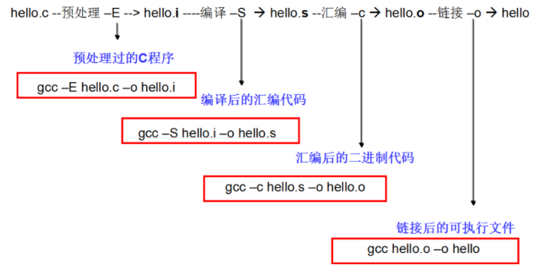

当我们按下运行按钮的时, 其实Qt Creator编译器做了5件事情:
1. 对源文件进行预处理, 生成预处理文件
2. 对预处理文件进行编译, 生成汇编文件
3. 对汇编文件进行编译, 生成二进制文件
4. 对二进制文件进行链接, 生成可执行文件
5. 运行可执行文件 

## 计算机运算过程分析

1. 通过地址总线找到对应地址的存储单元
2. 通过控制总线发送内存读取指令
3. 通过数据总线将内存中的值传输到CPU寄存器中
4. 在CPU中完成计算操作
5. 通过地址总线找到对应地址的存储单元
6. 通过控制总线发送内存写入指令
7. 通过数据总线将计算结果传输到内存中

## 预处理指令

### 预处理指令的概念

定义： C语言在对源程序进行编译之前，会先对一些特殊的预处理指令作解释(比如之前使用的#include文件包含指令)，产生一个新的源程序(这个过程称为编译预处理),之后再进行通常的编译。

注意：
1. 为了区分预处理指令和一般的C语句，所有预处理指令都以符号“#”开头，并且结尾不用分号 
2. 预处理指令可以出现在程序的任何位置，它的作用范围是从它出现的位置到文件尾。
3. 习惯上我们尽可能将预处理指令写在源程序开头，这种情况下，它的作用范围就是整个源程序文件。
4. C语言提供了多种预处理功能,如宏定义、文件包含、条件编译等。合理地使用预处理功能编写的程序便于阅读、修改、移植和调试,也有利于模块化程序设计。

### 宏定义

被定义为“宏”的标识符称为“宏名”。在编译预处理时,对程序中所有出现的“宏名”,都用宏定义中的字符串去代换,这称为“宏代换”或“宏展开”。

宏定义是由源程序中的宏定义命令完成的。宏代换是由预处理程序自动完成的。在C语言中,“宏”分为有参数和无参数两种。

#### 不带参数的宏定义

格式:#define 标识符 字符串 
> 其中的“#”表示这是一条预处理命令。凡是以“#”开头的均为预处理命令。“define”为宏定义命令。“标识符”为所定义的宏名。“字符串”可以是常数、表达式、格式串等

示例：
```
#include <stdio.h>
#define PI 3.14

int main(){
    float res = PI*PI;
    printf("PI的平方=%.2f",res);
    return 0;
}
```

**注意：**
1. 宏名一般用大写字母，以便与变量名区别开来，但用小写也没有语法错误
2. 对程序中用双引号扩起来的字符串内的字符，不进行宏的替换操作
```c
#define R 10
int main(){
    char *s ="Radio";//在第1行定义了一个叫R的宏，但是第4行中"Radio"里面的'R'并不会被替换成10
    return 0;
}
```
3. 在编译预处理用字符串替换宏名时，不作语法检查，只是简单的字符串替换。只有在编译的时候才对已经展开宏名的源程序进行语法检查。

```c
#define I 100
int main(){   
    int i[3]=I;
    return 0;
}
```
4. 宏名的有效范围是从定义位置到文件结束。如果需要终止宏定义的作用域，可以用#undef命令
```c
#define PI 3.14 
int main(){     
    printf("%f",PI); 
    return 0;    
}
#undef PI
void test(){
    printf("%f",PI);//不能使用
}
```

5. 定义一个宏时可以引用已经定义的宏名
```c
#define R 3.0 
#define PI 3.14 
#define L 2*PI*R 
#define S PI*R*R
```

6. 可用宏定义表示数据类型,使书写方便
```c
#define String char * 
int main(int argc,const char *argv[]){
    String str="Thisisastring!";
    return0;
}
```
#### 带参数的宏定义

C语言允许宏带有参数。在宏定义中的参数称为形式参数,在宏调用中的参数称为实际参数。对带参数的宏,在调用中,不仅要宏展开,而且要用实参去代换形参。

格式: #define 宏名(形参表) 字符串

```c
#define average(a,b) (a+b)/2 //第1行中定义了一个带有2个参数的宏average
int main(){
    int a = average(10,5); //第4行其实会被替换成：inta=(10+4)/2;
    printf("a的值为%d\n",a); //输出结果为：7是不是感觉这个宏有点像函数呢？
    return 0;
}
```
**注意：**
1. 宏名和参数列表之间不能有空格，否则空格后面的所有字符串都作为替换的字符串

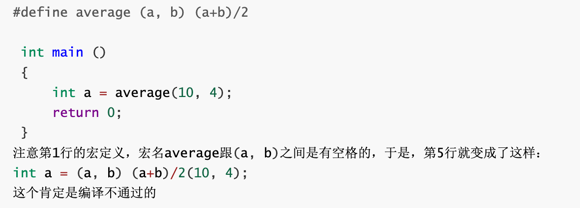

2. 带参数的宏在展开时，只作简单的字符和参数的替换，不进行任何计算操作。所以在定义宏时，一般用一个小括号括住字符串的参数

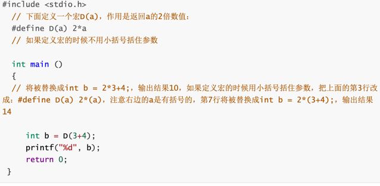

3. 计算结果最好也用括号括起来

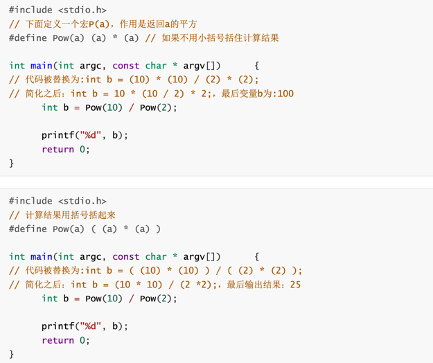

### 条件编译 #if-#else

定义：在很多情况下，我们希望程序的其中一部分代码只有在满足一定条件时才进行编译，否则不参与编译(只有参与编译的代码最终才能被执行)，这就是条件编译。

为什么要使用条件编译？

1) 按不同的条件去编译不同的程序部分,因而产生不同的目标代码文件。有利于程序的移植和调试。
2) 条件编译当然也可以用条件语句来实现。但是用条件语句将会对整个源程序进行编译,生成的目标代码程序很长,而采用条件编译,则根据条件只编译其中的程序段1或程序段2,生成的目标程序较短。

- 第一种格式

它的功能是,如常量表达式的值为真(非0),则将code1 编译到程序中,否则对code2编译到程序中。
```c
#if 常量表达式
    ...code1...
#else
    ...code2...
#endif

#define SCORE 67 
#if SCORE>90     
    printf("优秀\n"); 
#else            
    printf("不及格\n");
#endif
```
注意:是将代码编译进可执行程序, 而不是执行代码。条件编译后面的条件表达式中不能识别变量,它里面只能识别常量和宏定义。

- 第二种格式

它的功能是,如常量表达式的值为真(非0),则将code1 编译到程序中,否则对code2编译到程序中。
```c
#if 常量表达式
    ...code1...
#elif 常量表达式
    ...code2...
#else
    ...code3...
#endif

#define SCORE 67 
#if SCORE>90     
    printf("优秀\n");
#elif SCORE>60     
    printf("及格\n");
#else            
    printf("不及格\n");
#endif
```
注意:是将代码编译进可执行程序, 而不是执行代码。条件编译后面的条件表达式中不能识别变量,它里面只能识别常量和宏定义。

### typedef关键字

C语言不仅供了丰富的数据类型,而且还允许由用户自己定义类型说明符,也就是说允许由用户为数据类型取“别名”。

格式: typedef 原类型名 新类型名;

其中原类型名中含有定义部分,新类型名一般用大写表示,以便于区别。

有时也可用宏定义来代替typedef的功能,但是宏定义是由预处理完成的,而typedef则是在编译时完成的,后者更为灵活方便。

#### typedef使用

- 基本数据类型
```c
typedef int INTEGER
INTEGER a;//等价于int a;
```
- 也可以在别名的基础上再起一个别名
```c
typedef int Integer;
typedef Integer MyInteger;
```

用typedef定义数组、指针、结构等类型将带来很大的方便,不仅使程序书写简单而且使意义更为明确,因而增强了可读性。

- 数组类型
```c
typedef char NAME[20];//表示NAME是字符数组类型,数组长度为20。然后可用NAME说明变量,
NAME a;//等价于char a[20];
```

- 结构体类型
  - 第一种形式(先定义结构体，再typedef结构体)
```c
struct Person{
    int age;
    char *name;
};
typedef struct Person PersonType;
```
  - 第二种形式（定义结构体的时候typedef）
```c
typedef structPerson{
    int age;
    char*name;
} PersonType;
```

  - 第三种形式（匿名结构体typedef）
```c
typedef struct{
    int age;
    char*name;
} PersonType;
```

- 枚举
  - 第一种形式(先定义枚举类型，再typedef枚举类型)
```c
enum Sex{
    SexMan,
    SexWoman,
    SexOther
};
typedef enum Sex SexType;
```
  - 第二种形式（定义枚举类型的时候typedef）
```c
typedef enum Sex{
    SexMan,
    SexWoman,
    SexOther
} SexType;
```

- 第三种形式（匿名结构体typedef）
```c
typedef enum{
    SexMan,
    SexWoman,
    SexOther
} SexType;
```

- 指针

1. typedef与指向结构体的指针

```c
//定义一个结构体并起别名
typedef struct{
    float x;
    float y;
} Point;
//起别名
typedef Point *PP;
```

2. typedef与指向函数的指针

```c
//定义一个函数
int sum(int a,int b){
    return a + b;
}
//起别名
typedef int (*MySum)(int,int);

//定义一个指向sum函数的指针变量p
MySum p = sum;
```

#### 宏定义与函数以及typedef区别

##### 宏定义与函数的区别

从整个使用过程可以发现，带参数的宏定义，在源程序中出现的形式与函数很像。但是两者是有本质区别的：
1. 宏定义不涉及存储空间的分配、参数类型匹配、参数传递、返回值问题
2. 函数调用在程序运行时执行，而宏替换只在编译预处理阶段进行。所以带参数的宏比函数具有更高的执行效率


##### 宏定义与typedef的区别
1. 宏定义只是简单的字符串替换, 是在预处理完成的。
2. typedef是在编译时处理的,它不是作简单的代换,而是对类型说明符重新命名。被命名的标识符具有类型定义说明的功能。

示例一：
```c
#include <stdio.h>
typedef char *string; //typedef
#define newString char* //define

void say(){
    string a = "i love you";
    printf("%s\n",a);
    newString b = "i love you too";
    printf("%s",b);

}

int main(){
    say();
}
```

示例二：
```c
typedef char *String1;//给char*起了个别名String1
#define String2 char *//定义了宏String2
int main(int argc,const char * argv[]){
    /*只有str1、str2、str3才是指向char类型的指针变量
     * 由于String1就是char*，所以下面的这行代码等于:
     * char *str1;
     * char *str2;
     * */
    String1 str1,str2;
    
    /*宏定义只是简单替换,所以下面相当于
     * char *str3,str4;
     * *号只对最近的一个有效,所以相当于
     * char *str3;char str4;
     * */
    String2 str3,str4;
    return0;
}
```

### const关键字

const是一个类型修饰符，使用const修饰变量则可以让变量的值不能被直接改变。

#### const作用

- 可以定义const常量,具有不可变性
```c
const int Max=100;
int Array[Max];
```
- 便于进行类型检查,使编译器对处理内容有更多了解,消除了一些隐患。
```c
//编译器就会知道i是一个常量,不允许修改
void func(const int i){
    
}
```

- 可以避免意义模糊的数字出现,同样可以很方便地进行参数的调整和修改。
> 同宏定义一样,可以做到不变则已,一变都变!如(1)中,如果想修改Max的内容,只需要:const int Max=you want;即可

- 可以保护被修饰的东西,防止意外的修改,增强程序的健壮性。还是上面的例子,如果在函数体内修改了i,编译器就会报错;
```c
void f(const int i){
    i=10;//error!
}
```

- 可以节省空间,避免不必要的内存分配 
```c
#define PI 3.14159//常量宏
const doulbe Pi=3.14159;//此时并未将Pi放入ROM中
double i=Pi;//此时为Pi分配内存,以后不再分配!
double I=PI;//编译期间进行宏替换,分配内存
double j=Pi;//没有内存分配
double J=PI;//再进行宏替换,又一次分配内存!
// const定义常量从汇编的角度来看,只是给出了对应的内存地址,而不是像#define一样给出的是立即数,所以,const定义的常量在程序运行过程中只有一份拷贝,而#define定义的常量在内存中有若干个拷贝

```

- 提高了效率。编译器通常不为普通const常量分配存储空间,而是将它们保存在符号表中,这使得它成为一个编译期间的常量,没有了存储与读内存的操作,使得它的效率也很高。

#### 如何使用const

- 修饰一般常量（一般常量是指简单类型的常量）。这种常量在定义时,修饰符const可以用在类型说明符前,也可以用在类型说明符后。
```c
int const x=2;
const int x=2;
```
- 当然,我们可以偷梁换柱进行更新: 通过强制类型转换,将地址赋给变量,再作修改即可以改变const常量值
```c
//const对于基本数据类型,无论写在左边还是右边,变量中的值不能改变
void test11(){
    const int a=5;
    //a=666;//直接修改会报错
    
    //偷梁换柱,利用指针指向变量,利用指针间接修改变量中的值
    int *p;
    p=&a;
    *p=10;
    printf("a=%d---a的地址%p\n",a,&a);//5---add1
    printf("*p=%d---*p的地址%p\n",*p,p);//10--add2
    //上述常量a和变量*p的地址一样，表明上值不一样，这是由于编译器做了优化，读取a时接从寄存器中读取3给a，而不从内存中读取。
    //如果定义a时加一个volatile，再次打印就会发现a和*p的值相同
}
```

- 修饰常数组(值不能够再改变了)定义或说明一个常数组可采用如下格式
```c
int const a[5]={1,2,3,4,5};
const int a[5]={1,2,3,4,5};
a[1]=55;//错误
```
- 修饰函数的常量参数
> const修饰符也可以修饰函数的传递参数

格式:void Fun(const int Var); 
> 告诉编译器Var在函数体中的无法改变,从而防止了使用者的一些无意的或错误的修改

- 修饰函数的返回值
> const修饰符也可以修饰函数的返回值,限制返回值不可被改变。
```c
const int Fun1();
const MyClass Fun2();
```

- 修饰常指针

1. const int *A; //const修饰指针,A可变,A指向的值不能被修改
2. int const *A; //const修饰指向的对象,A可变,A指向的对象不可变
3. int *const A; //const修饰指针A, A不可变,A指向的对象可变
4. const int *const A;//指针A和A指向的对象都不可变

**技巧：**
1. 先看"*"的位置，如果const在"*"的左侧表示值不能修改,但是指向可以改。
2. 如果const在"*"的右侧表示指向不能改,但是值可以改。
3. 如果在“*”的两侧都有const标识指向和值都不能改。

## 内存管理

### 进程空间

- 程序：是经源码编译后的可执行文件，可执行文件可以多次被执行，比如我们可以多次打开office。
- 进程：是程序加载到内存后开始执行，至执行结束，这样一段时间概念，多次打开的wps,每打开一次都是一个进程，当我们每关闭一个 office，则表示该进程结束。

程序是静态概念，而进程是动态/时间概念。

进程空间示意图：
有了进程和程序的概念以后，我们再来看一下，程序被加载到内存以后内存空间布局是什么样的
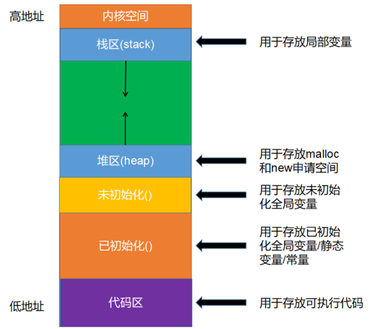

### 栈内存(Stack)
- 栈中存放任意类型的变量，但必须是 auto 类型修饰的，即自动类型的局部变量，随用随开，用完即消。
- 内存的分配和销毁系统自动完成，不需要人工干预。
- 栈的最大尺寸固定，超出则引起栈溢出。局部变量过多，过大或递归层数太多等就会导致栈溢出。
```c
int ages[10240*10240];//程序会崩溃,栈溢出
```

### 堆内存(Heap)
- 堆内存可以存放任意类型的数据，但需要自己申请与释放。
- 堆大小，想像中的无穷大，但实际使用中，受限于实际内存的大小和内存是否连续性。
```c
int *p=(int*)malloc(10240*1024);//不一定会崩溃
```

```c
#include <stdlib.h>
#include <stdio.h>

int main(){
    //存储在栈中,内存地址从小到大
    int *p1 = malloc(4);
    *p1=10;
    int *p2=malloc(4);
    *p2=20;
    printf("p1=%p\n",p1);//p1=0x600002054040
    printf("p2=%p\n",p2);//p2=0x600002054050
}
```

### malloc函数

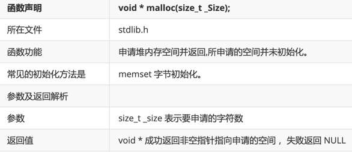

```c
//
// Created by 松夏 on 2023/9/7.
//
#include <stdio.h>
#include <stdlib.h>
#include <string.h>

int main(){
/**
 * malloc
 * 第一个参数:需要申请多少个字节空间
 * 返回值类型:void *
 **/
int *p = (int *)malloc(sizeof(int));
printf("p=%i\n",*p);//p=0

//初始化
/**
 * 第一个参数:需要初始化的内存地址
 * 第二个初始:需要初始化的值
 * 第三个参数:需要初始化对少个字节
 * */
memset(p,6,sizeof(int));
printf("p=%i\n",*p);//p=101058054

return 0;
}
```
### free函数
> 注意: 通过malloc申请的存储空间一定要释放, 所以malloc和free函数总是成对出现

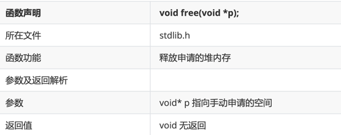

```c
int freeTest(){
    int *p = (int *) malloc(sizeof(int));
    memset(p,8,sizeof(int));
    free(p);
    return 0;
}
```

### calloc函数

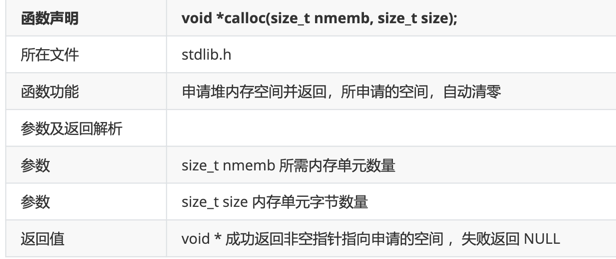

```c
int callocTest(){
    int *p = (int *)calloc(3,sizeof(int));
    p[0] = 12;
    p[1] = 23;
    p[2] = 34;
    printf("p[0]=%i\n",p[0]);
    printf("p[1]=%i\n",p[1]);
    printf("p[2]=%i\n",p[2]);
    free(p);
    return 0;
}
```

### realloc函数
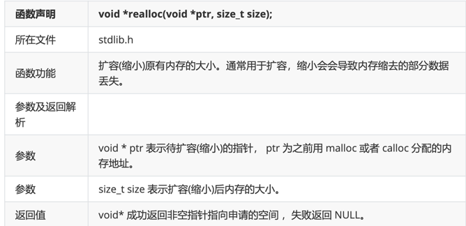

注意点:

1. 若参数ptr==NULL，则该函数等同于 malloc返回的指针，可能与 ptr 的值相同，也有可能不同。

```c
int reallocTest1(){
    int *p = NULL;
    p = realloc(p,sizeof(int));//此时等同于malloc
    *p = 888;
    printf("p=%i\n",*p);
    free(p);
    return 0;
}
```

2. 若相同，则说明在原空间后面申请，否则，则可能后续空间不足，重新申请的新的连续空间，原数据拷贝到新空间，原有空间自动释放。

```c
int reallocTest2(){
    int *p = (int *)malloc(sizeof(int));
    printf("p的地址=%p\n",p);
    // 如果能在传入存储空间地址后面扩容,返回传入存储空间地址
    // 如果不能在传入存储空间地址后面扩容,返回一个新的存储空间地址
    p = realloc(p,sizeof(int)*2);
    printf("p的地址=%p\n",p);
    *p=666;
    printf("*p=%i\n",*p);
    //3.释放空间
    free(p);

    return 0;
}
```

### 文件基本概念

文件流：C语言把文件看作是一个字符的序列，即文件是由一个一个字符组成的字符流，因此c语言将文件也称之为文件流。

文件分类：

- 文本文件：以ASCII码格式存放，一个字节存放一个字符。文本文件的每一个字节存放一个ASCII码，代表一个字符。这便于对字符的逐个处理，但占用存储空间较多，而且要花费时间转换。.c文件就是以文本文件形式存放的。
````c
// 文本形式
void fileTest1(){
    int num = 999;
    FILE *fa = fopen("./file_test/aa.txt","w");
    fprintf(fa,"%d",num);
    fclose(fa);
}
````

- 二进制文件：以补码格式存放。二进制文件是把数据以二进制数的格式存放在文件中的，其占用存储空间较少。数据按其内存中的存储形式原样存放，.exe文件就是以二进制文件形式存放的。
```c
// 二进制形式
void fileTest2(){
    int num = 999;
    FILE *fb = fopen("./file_test/bin.txt","w");
    fwrite(&num,4,1,fb);
    fclose(fb);
}
```
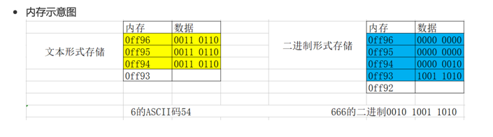

文本工具默认会按照ASCII码逐个直接解码文件, 由于文本文件存储的就是ASCII码, 所以可以正常解析显示, 由于二进制文件存储的不是ASCII码, 所以解析出来之后是乱码。

dddddddddd


