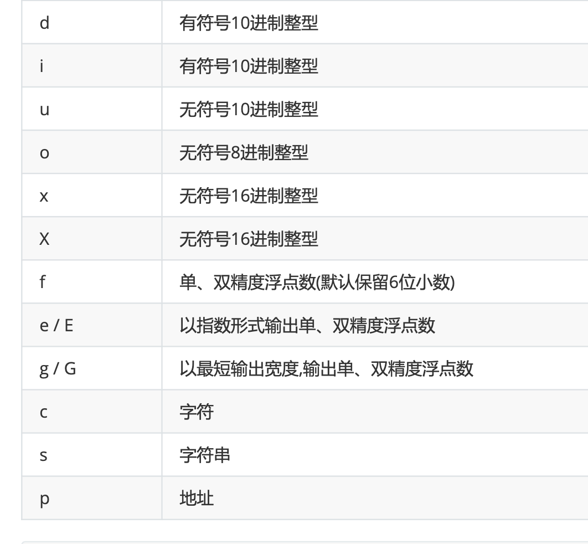
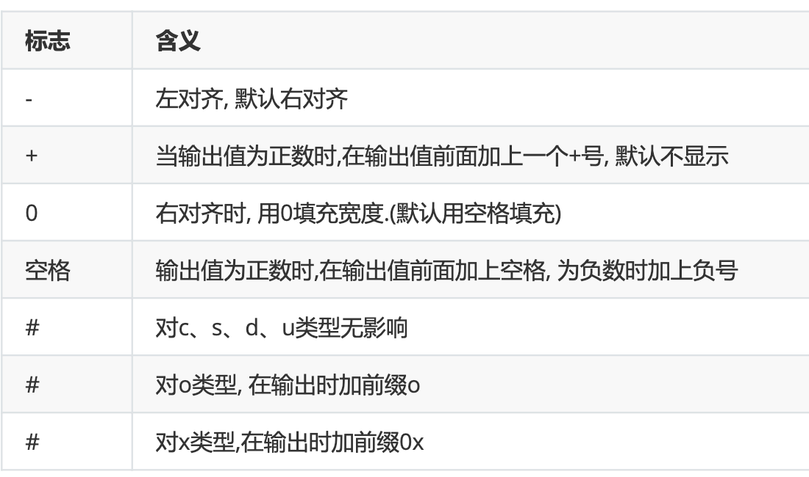
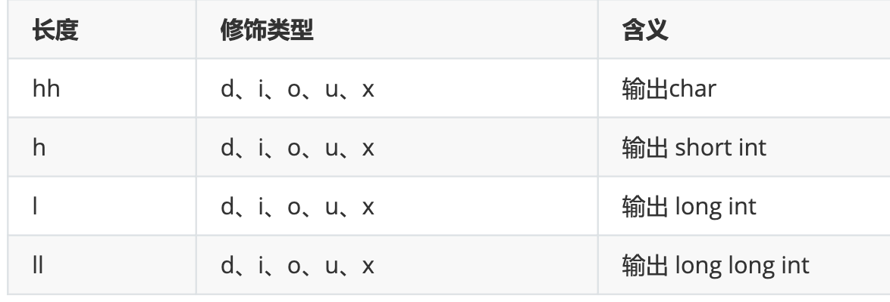
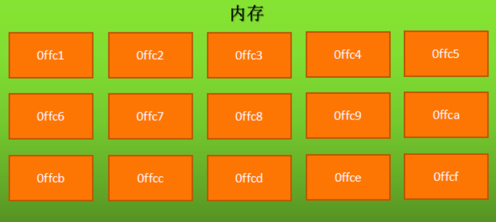
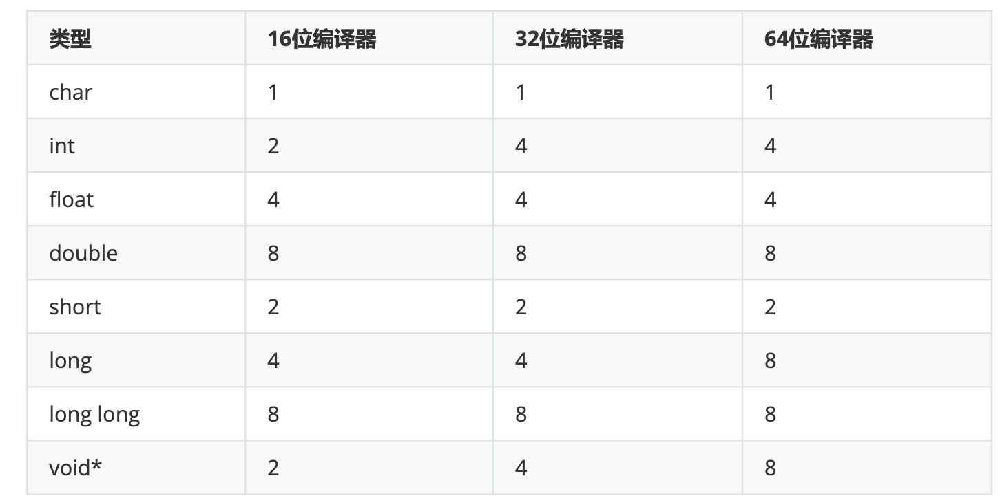
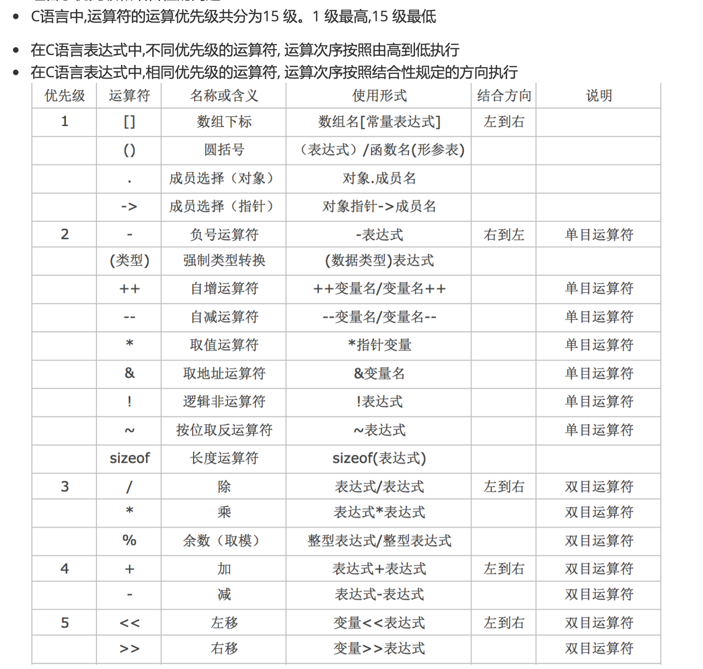
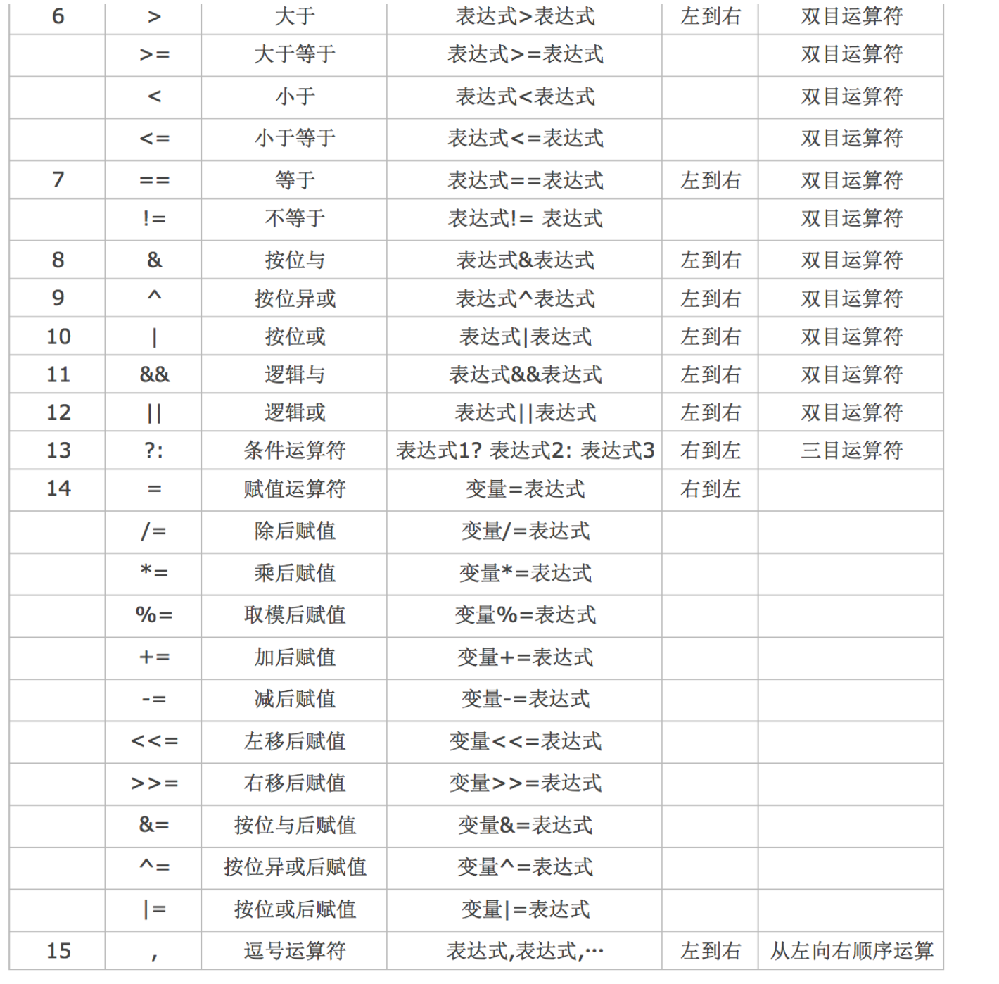

## 常量

### 定义

声明后不能改变值和类型的数据。

### 类型
> 整形常量、实形常量、字符常量、字符串常量

#### 整形常量

- 十进制整数
- 八进制整数
  八进制形式的常量都以0开头
- 十六进制整数
  十六进制形式的常量都以0x开头
- 二进制整数
  二进制形式的常量都以0b开头

#### 实形常量

- 小数形式

- 单精度小数
以字母f或字母F结尾。例如:0.0f、1.01f

- 双精度小数
  - 十进制小数形式：

  例如:3.14、 6.66，默认就是双精度。可以没有整数位只有小数位，例如: .3、 .6f。

  - 指数形式以幂的形式表示
  
  以字母e或字母E后跟一个10为底的幂数，指数形式的常量就是科学计数法的另一种表示,比如123000,用科学计数法表示为1.23×10的5次方用C语言表示就是1.23e5或1.23E5字母e或字母E后面的指数必须为整数字母e或字母E前后必须要有数字字母e或字母E前后不能有空格字符常量

#### 字符常量
字符型常量都是用''(单引号)括起来的。例如:'a'、'b'、'c'，字符常量的单引号中只能有一个字符特殊情况: 如果是转义字符,单引号中可以有两个字符。例如:'\n'、'\t'

#### 字符串常量
字符串常量都是用""(双引号)括起来的。例如:"a"、"abc"、"lnj"系统会自动在字符串常量的末尾加一个字符'\0'作为字符串结束标志自定义常量后期讲解内容。

### 例子
```c
void printConst() {
    const int Name = 21;
    const float XiaoShu = 1.01f;
    const double bb = 3.14;
    const double cc = .6;
    const char dd = 'd';
    const char* ee = "ee";
    const char* ff = "李江南";
    printf("Name\tXiaoShu\tbb\tcc\tdd\tee\tff\t\n");
    printf("%d\t%f\t%f\t%f\t%c\t%s\t%s\t\n",Name,XiaoShu,bb,cc,dd,ee,ff);
}
```

## 变量
类型不变，值可以改变的量。

### 定义变量

- 为什么要定义变量?

任何变量在使用之前，必须先进行定义, 只有定义了变量才会分配存储空间, 才有空间存储数据。

- 为什么要限定类型?

用来约束变量所存放数据的类型。一旦给变量指明了类型，那么这个变量就只能存储这种类型的数据，内存空间极其有限,不同类型的变量占用不同大小的存储空间。

- 为什么要指定变量名称?

存储数据的空间对于我们没有任何意义, 我们需要的是空间中存储的值。只有有了名称, 我们才能获取到空间中的值。

#### 定义方式

- 格式1:变量类型 变量名称

```c
int a;
int b;
```

- 格式2:变量类型 变量名称,变量名称

> 连续定义, 多个变量之间用逗号(,)号隔开

```c
int a;
int a,b,c;
```

### 变量使用

#### 赋值

```c
int value = 998;
```
可以利用=号往变量里面存储数据，在C语言中,利用=号往变量里面存储数据, 我们称之为给变量赋值。

注意:这里的=号，并不是数学中的“相等”，而是C语言中的赋值运算符，作用是将右边的整型常量998赋值给左边的整型变量value赋值的时候,= 号的左侧必须是变量 (10=b,错误)

#### 初始化
> C语言中, 变量的第一次赋值，我们称为“初始化”

##### 初始化方式

- 先定义,后初始化
```c
intvalue;value=998;
```

- 定义时同时初始化
```c
inta=10;intb=4,c=2;
```

**不初始化里面存储什么?**

- 随机数
- 上次程序分配的存储空间,存数一些内容,“垃圾”
- 系统正在用的一些数据

#### 修改变量的值

多次赋值即可，每次赋值都会覆盖原来的值。

```c
int a = 10;
a = 20;
```

变量之间的值传递可以将一个变量存储的值赋值给另一个变量。

```c
int a = 10;
int b;
b = a;
```

#### 查看变量的值

- 使用printf输出一个或多个变量的值
```c
int a = 10;
printf("a=%d",a)
```

- 输出其它类型变量的值
```c
double height=1.75;
char blood='A';
printf("height=%.2f,血型是%c",height,blood);
```
##### printf函数说明

格式： %[标志][输出宽度][.精度][长度]类型

- 类型打印



```c
void printVariable(){
    int age = 21;
    float money = 3.14f;
    double high = 170.345;
    char aliasName = 'p';
    char* name = "maxwell";
    printf("Name\taliasName\thigh\tmoney\tage\t\n");
    printf("%s\t%c\t%f\t%f\t%d\n",name,aliasName,high,money,age);
}
```

- 宽度打印  

用十进制整数来指定输出的宽度, 如果实际位数多于指定宽度,则按照实际位数输出, 如果实际位数少于指定宽度则以空格补位

```c
//格式: printf("a=%[宽度]类型",a)
void printWidth(){
    int a = 111;
    printf("a=%6d",a);//000111
}
```

- 标志打印

> printf("a=%[标志][宽度]类型",a)



- 精度打印

> printf("a=%[精度]类型",a)

精度格式符以"."开头, 后面跟上十进制整数, 用于指定需要输出多少位小数, 如果输出位数大于指定的精度, 则删除超出的部分

```c
float pi = 3.1415926;
printf("pi=%.2f\n",pi);
printf("pi=%.*f\n",4,pi);
```
**注意：**

1. 实型(浮点类型)有效位数问题
  - 对于单精度数,使用%f格式符输出时,仅前6~7位是有效数字
  - 对于双精度数,使用%f格式符输出时,前15~16位是有效数字
  - 有效位数和精度(保留多少位)不同, 有效位数是指从第一个非零数字开始,误差不超过本数位半个单位的、精确可信的数位
  - 有效位数包含小数点前的非零数位
  
- 长度打印

> 格式: printf("a=%[长度]类型",a);



```c
void printLength(){
    printf("\n---------------\n");
    char a = 's';
    short int b = 123;
    int c = 123;
    long int d = 123;
    long long int e = 123;
    printf("a=%hhd\n",a);//115
    printf("b=%hd\n",b);//123
    printf("c=%d\n",c);//123
    printf("d=%ld\n",d);//123
    printf("d=%lld\n",e);//123
}
```


#### 变量的作用域

- 局部变量

局部变量是在代码块内定义的, 其作用域仅限于代码块内, 离开该代码块后无法使用

例如：
```c
int main() {
    int a = 10;//变量a只在main函数中有效
    return 0;
}

int main(){
    {
        inti=998;//作用域开始
    }//作用域结束
    printf("i=%d\n",i);//不能使用
    return 0;
}
```

- 全局变量

全局变量也称为外部变量,它是在代码块外部定义的变量

```c
int a = 20;

void main() {
    printf("a=%d\n",a);//a=20
    a = 10;
    printf("a=%d\n",a);//a=10
}

```
注意：同一作用域范围内不能有相同名称的变量

#### 变量的内存分析

##### 字节和地址
为了更好地理解变量在内存中的存储细节，先来认识一下内存中的“字节”和“地址”每一个小格子代表一个字节：



**说明：**
1. 每个小格子代表一个字节
2. 每个字节都有自己的内存地址
3. 内存地址是连续的

##### 不同类型的变量占用空间大小


##### 变量存储的过程
1. 根据定义变量时声明的类型和编译环境确定需要开笔多大的存储空间
2. 在内存中开辟空间，开辟空间时从内存地址大的开始开辟（内存寻址从大到小）
3. 将数据保存到已经开辟好的对应内存空间中

#### Scanf函数

scanf函数用于接收键盘输入的内容, 是一个阻塞式函数,程序会停在scanf函数出现的地方, 直到接收到数据才会执行后面的代码。

格式：scanf("格式控制字符串",地址列表)

地址列表项中只能传入变量地址, 变量地址可以通过&符号+变量名称的形式获取。
```c
void scanfTest(){
    int number;
    scanf("%d",&number);
    printf("number=%d\n",number);
}
```
##### 用法

- 接收非字符和字符串类型时, 空格、Tab和回车会被忽略
- 接收多条数据：格式控制字符串和地址列表项在数量和类型上必须一一对应
- 非字符和字符串情况下建议明确指定多条数据之间分隔符(\n是scanf函数的结束符号, 所以格式化字符串中不能出现\n)
```c
void manyScanf()
{
    int a,b;
    scanf("%d,%d",&a,&b);
    printf("a=%d;b=%d",a,b);
}
```
##### scanf运行原理
1. 系统会将用户输入的内容先放入输入缓冲区
2. scanf方式会从输入缓冲区中逐个取出内容赋值给变量
3. 如果输入缓冲区的内容不为空,scanf会一直从缓冲区中获取,而不要求再次输

可以利用setbuf方法清空缓冲区(所有平台有效)，格式：setbuf(stdin,NULL);

```c
void clearCache(){
    int a,b;
    char c;
    scanf("%d,%d,%c",&a,&b,&c);
    printf("a=%d;b=%d;c=%c",a,b,c);
    setbuf(stdin,NULL);//清空输入缓存区
    int a1,b1;
    char c1;
    scanf("%d,%d,%c",&a1,&b1,&c1);
    printf("a1=%d;b1=%d;c1=%c",a1,b1,c1);
}
```
#### putchar 和 getchar

```c
//向控制台输出一个字符
void putChar(){
    char a = 'a';
    putchar(a);
}

//从键盘获得一个字符
void getChar(){
    char a;
    a=getchar();//获取一个字符
    printf("ch=%c\n",a);
}
```

### 运算符

#### 运算符分类

- 功能分类：

1. 算术运算符
2. 赋值运算符
3. 关系运算符
4. 逻辑运算符
5. 位运算符

- 按参与运算的操作数个数划分：

1. 单目运算（例如：i++）
2. 双目运算（a+b）
3. 三目运算（问号表达式如:  a>b ? 1 : 0）

#### 运算符的优先级和结合性



#### 算术运算符

乘、除、求余、加、减

**注意：**
1. 如果参与运算的两个操作数皆为整数, 那么结果也为整数
2. 如果参与运算的两个操作数其中一个是浮点数, 那么结果一定是浮点数
3. 求余运算符, 本质上就是数学的商和余中的余数
4. 求余运算符, 参与运算的两个操作数必须都是整数, 不能包含浮点数
5. 求余运算符, 被除数小于除数, 那么结果就是被除数
6. 求余运算符, 运算结果的正负性取决于被除数,跟除数无关, 被除数是正数结果就是正数,被除数是负数结果就是负数
7. 求余运算符, 被除数为0, 结果为0
8. 求余运算符, 除数为0, 没有意义(不要这样写)

#### 赋值运算符
=、+=、-=、*=、/=、%=

#### 自增自减运算符

i++,i--,++i,--i

**说明：**
1. 如果只有单个变量, 无论++写在前面还是后面都会对变量做+1操作
2. 如果出现在一个表达式中, 那么++写在前面和后面就会有所区别：

前缀表达式: ++x, --x;其中x表示变量名,先完成变量的自增自减1运算,再用x的值作为表达式的值;即“先变后用”,也就是变量的值先变,再用变量的值参与运算

后缀表达式: x++, x--;先用x的当前值作为表达式的值,再进行自增自减1运算。即“先用后变”,也就是先用变量的值参与运算,变量的值再进行自增自减变

3. 自增、自减运算只能用于单个变量,只要是标准类型的变量,不管是整型、实型,还是字符型变量等,但不能用于表达式或常量（错误用法: ++(a+b);5++;）
4. 企业开发中尽量让++ -- 单独出现, 尽量不要和其它运算符混合在

#### sizeof运算符

sizeof可以用来计算一个变量或常量、数据类型所占的内存字节数。

格式：sizeof(常量 or 变量 or 数据类型);

**注意：**
1. 如果是数据类型不能省略括号
2. sizeof()和+=、*=一样是一个复合运算符, 由sizeof和()两个部分组成, 但是代表的是一个整体，所以sizeof不是一个函数, 是一个运算符, 该运算符的优先级是2

#### 逗号运算符

在C语言中逗号“,”也是一种运算符,称为逗号运算符。其功能是把多个表达式连接起来组成一个表达式,称为逗号表达式。

逗号运算符会从左至右依次取出每个表达式的值, 最后整个逗号表达式的值等于最后一个表达式的值

格式: 表达式1，表达式2，......，表达式n（例如: int result=a+1,b=3*4;）

```c
void douhao(){
    int a =10,b=20,c;
    int d = (a+1,b+4);
    printf("d=%d\n",d);//24
}
```
#### 关系运算符

<、==、<=、!=、>、=>

```c
void compare(){
    int res = 10 == 5>3;
    printf("res=%i\n",res);//0
}
```

无论是float还是double都有精度问题, 所以一定要避免利用==判断浮点数是否相等

#### 逻辑运算符
!、&&、||

#### 三目运算符

格式：表达式1？表达式2(结果A)：表达式3(结果B)

### 类型转换

- 强制类型转换

格式：(需要转换的类型)(表达式)

```c
int a = (int)1.34;
```

- 自动类型转换

1. 算数转换 

系统会自动对占用内存较少的类型做一个“自动类型提升”的操作, 先将其转换为当前算数表达式中占用内存高的类型, 然后再参与运算.

```c
double b = 1.0 / 2;
```


2. 赋值转换

赋值时左边是什么类型,就会自动将右边转换为什么类型再保存

```c
int a = 10.88;//10(直接舍去小数部分)
```
